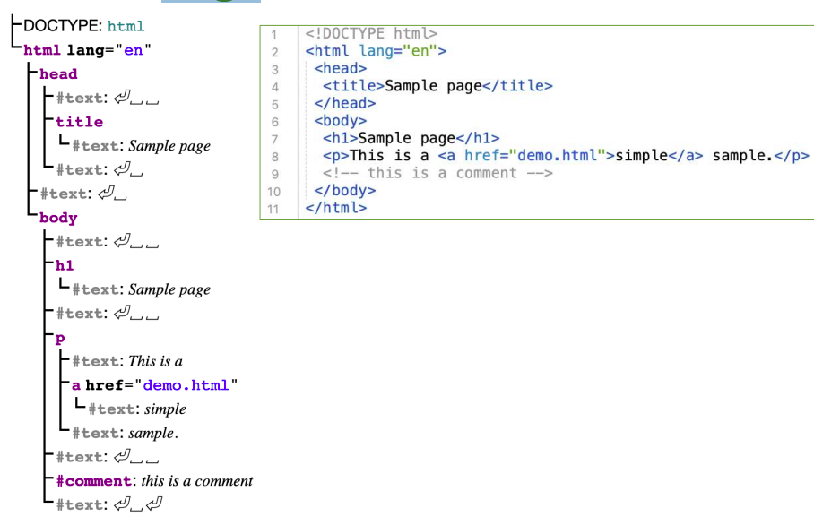

# La Pagina Web
Una pagina web è un documento digitale identificato da una URL (indirizzo) e normalmente visualizzato mediante un browser.

## Funzionamento della Pagina Web

La pagina web non è nel nostro PC, ma il browser deve:
1. **Scoprire dove si trova**.
2. **Chiedere che ci venga inviato**.
3. **Controllare e verificare ciò che riceviamo**.
4. **Mostrarlo**.

## URL: Uniform Resource Locator

Le pagine web sono identificate da un **Uniform Resource Locator (URL)**, che è un identificatore per la posizione di un documento. È formato da:
- **Protocollo**
- **Host**
- **Path**

Esempio di formato: `protocollo://host/path`.

---

# Internet

Internet è un sistema di dispositivi elettronici interconnessi.

### IP: Internet Protocol
- Ogni computer ha un **indirizzo IP**.
- Un computer connesso alla rete può condividere informazioni.

---

# Il World Wide Web (WWW)

Il **World Wide Web (WWW)** è uno dei modi con cui le informazioni possono essere condivise. È un insieme di:
- **Pagine web** ed altri documenti collegati tra loro tramite collegamenti ipertestuali (**link**).

### Protocollo Principale
- Il protocollo principale per scambiare documenti è **HTTP** (HyperText Transfer Protocol).

---

# Nomi e Indirizzi

- All'uomo è comodo dare un **nome** ai server.
- Ai computer serve un **indirizzo numerico** per comunicare con le altre macchine.
- Esistono computer che traducono nomi in indirizzi IP: i **Domain Name Server (DNS)**.

---

# Server Web

Un **server web** è un computer che risponde a richieste di documenti. In realtà, chi offre il servizio è un programma chiamato **server web**.

### Funzionamento del Server Web
1. Aspetta una richiesta.
2. Cerca un documento.
3. Lo invia al richiedente.

- Il server web deve parlare **HTTP**, per questo spesso lo chiamiamo **Server HTTP**.
- I computer server non sono particolari: ogni computer può diventare un server.

---

# Client Web

I **client web** sono software che fanno richieste HTTP ai server. Sono clienti dei server.

### Esempi di Client Web
- I più comuni client web sono i **browser**.

### Processo di Richiesta di un Documento
1. L'utente inserisce un indirizzo.
2. Il browser chiede un documento al server.
3. Il server lo spedisce.
4. Il browser lo mostra all'utente.

### I Browser
- I browser parlano HTTP come i server web.
    - Sia le richieste che le risposte sono gestite mediante HTTP.
- Richiedono documenti di qualsiasi tipo: testo, immagini, video, audio, script, ecc.
- I browser visualizzano i documenti richiesti al server in una finestra.
    - Spesso gli stessi documenti sono mostrati in modo diverso dai diversi browser.

---

# Gestione di Internet

- **Internet Engineering Task Force (IETF)**:
    - Standard dei protocolli internet.
- **Internet Corporation for Assigned Names and Numbers (ICANN)**:
    - Decide i nomi dei domini di primo livello.
- **World Wide Web Consortium (W3C)**:
    - Standard del web.

---

# Cosa c'è dentro una Pagina Web

- **Hypertext Markup Language (HTML)**: markup semantico per il contenuto delle pagine web.
- **Cascading Style Sheets (CSS)**: stile delle pagine web.
- **JavaScript**: aggiunge interattività alle pagine web.

### Markup
- Il documento è pieno di tag HTML:
    - `<!DOCTYPE html>`, `<html>`, `<head>`, `<title>`, ecc.
    - Testo fra parentesi acute.
- I tag:
    - Non sono mostrati dal browser.
    - Sono definiti dallo standard.
- Molti tag sono a coppie:
    - `<body> ... </body>` (tag di apertura e tag di chiusura).
- Alcuni tag non hanno chiusura:
    - `
`, ``.

### Richiesta di File
- Ogni figura è in un file separato.
- Alcuni elementi dicono al browser di richiedere altri file.
    - Esempio: quando il browser trova l'elemento ``, fa una nuova richiesta HTTP per l'immagine e la posiziona nella pagina.
    - Esempio: quando il browser trova l'elemento ``, fa una nuova richiesta HTTP per l'immagine e la posiziona nella pagina.
    - Per video, audio, ecc., il processo è simile.
    - Su connessioni lente, le immagini possono comparire con un leggero ritardo.

### Aggiungere lo Stile
- Lo stile è definito in un altro file: `style.css`.
- I file CSS contengono direttive sull'aspetto della pagina.
- Queste istruzioni seguono il linguaggio **Cascading Style Sheets**.

---

# HTML

- Sigla per **HyperText Markup Language**.
- Linguaggio per strutturare documenti ipertestuali.

### Esempio
- Documento → curriculum.
- Documento ipertestuale → il curriculum contiene dei link.
- Documento ipertestuale strutturato → il curriculum ha un titolo.

- È uno standard del **W3C**.
- È lo standard più utilizzato per creare pagine web visualizzabili attraverso i browser.

### Tag HTML
- I tag possono essere annidati.

### Attributi
- Alcuni elementi hanno attributi:
    - Coppie chiave-valore definite nel tag di apertura.
    - Specificati dallo standard per i diversi tag.
    - Forniscono informazioni aggiuntive sull'elemento.

### Elementi Vuoti
- Definiti con un solo tag.
- Possono contenere attributi.

---

# Struttura di Documenti HTML

### Albero degli Elementi
- L'elemento `<html>` è la radice dell'albero e contiene tutti gli altri.
- L'elemento `<head>` fornisce informazioni sul documento.
- L'elemento `<body>` contiene il contenuto visibile.

### Dichiarazione `<!DOCTYPE>`
- Serve a indicare al browser il tipo di documento HTML.
- Diversi tipi di dichiarazioni:
    - **HTML5**: `<!DOCTYPE html>`.
    - **HTML 4.01**: `<!DOCTYPE HTML PUBLIC "-//W3C//DTD HTML 4.01 Transitional//EN" "http://www.w3.org/TR/html4/loose.dtd">`.
    - **XHTML 1.0**: `<!DOCTYPE html PUBLIC "-//W3C//DTD XHTML 1.0 Transitional//EN" "http://www.w3.org/TR/xhtml1/DTD/xhtml1-transitional.dtd">`.

### Sezione `<head>`
- Contiene metadati relativi alla pagina:
    - Descrizione, charset, autore, ecc.
- Generalmente il contenuto del `<head>` non viene visualizzato nella pagina web.
- Contiene il titolo della pagina.- Ogni figura è in un file separato.
- Alcuni elementi dicono al browser di richiedere altri file.
    - Esempio: quando il browser trova l'elemento ``, fa una nuova richiesta HTTP per l'immagine e la posiziona nella pagina.
    - Per video, audio, ecc., il processo è simile.
    - Su connessioni lente, le immagini possono comparire con un leggero ritardo.

### Aggiungere lo Stile
- Lo stile è definito in un altro file: `style.css`.
- I file CSS contengono direttive sull'aspetto della pagina.
- Queste istruzioni seguono il linguaggio **Cascading Style Sheets**.

---

# HTML

- Sigla per **HyperText Markup Language**.
- Linguaggio per strutturare documenti ipertestuali.

### Esempio
- Documento → curriculum.
- Documento ipertestuale → il curriculum contiene dei link.
- Documento ipertestuale strutturato → il curriculum ha un titolo.

- È uno standard del **W3C**.
- È lo standard più utilizzato per creare pagine web visualizzabili attraverso i browser.

### Tag HTML
- I tag possono essere annidati.

### Attributi
- Alcuni elementi hanno attributi:
    - Coppie chiave-valore definite nel tag di apertura.
    - Specificati dallo standard per i diversi tag.
    - Forniscono informazioni aggiuntive sull'elemento.

### Elementi Vuoti
- Definiti con un solo tag.
- Possono contenere attributi.

---

# Struttura di Documenti HTML

### Albero degli Elementi
- L'elemento `<html>` è la radice dell'albero e contiene tutti gli altri.
- L'elemento `<head>` fornisce informazioni sul documento.
- L'elemento `<body>` contiene il contenuto visibile.

### Dichiarazione `<!DOCTYPE>`
- Serve a indicare al browser il tipo di documento HTML.
- Diversi tipi di dichiarazioni:
    - **HTML5**: `<!DOCTYPE html>`.
    - **HTML 4.01**: `<!DOCTYPE HTML PUBLIC "-//W3C//DTD HTML 4.01 Transitional//EN" "http://www.w3.org/TR/html4/loose.dtd">`.
    - **XHTML 1.0**: `<!DOCTYPE html PUBLIC "-//W3C//DTD XHTML 1.0 Transitional//EN" "http://www.w3.org/TR/xhtml1/DTD/xhtml1-transitional.dtd">`.

### Sezione `<head>`
- Contiene metadati relativi alla pagina:
    - Descrizione, charset, autore, ecc.
- Generalmente il contenuto del `<head>` non viene visualizzato nella pagina web.
- Contiene il titolo della pagina.

### Titolo della Pagina: `<title>`
- Definisce il titolo della pagina.
    - Visualizzato dal browser nella toolbar.
    - Usato quando la pagina è memorizzata nei preferiti.
    - Usato dai motori di ricerca.
- Tale elemento è obbligatorio nelle pagine.
- Ci può essere un solo elemento `<title>`.

### Sezione `<body>`
- Contiene la parte visibile della pagina.
- Normalmente diviso in sezioni.
