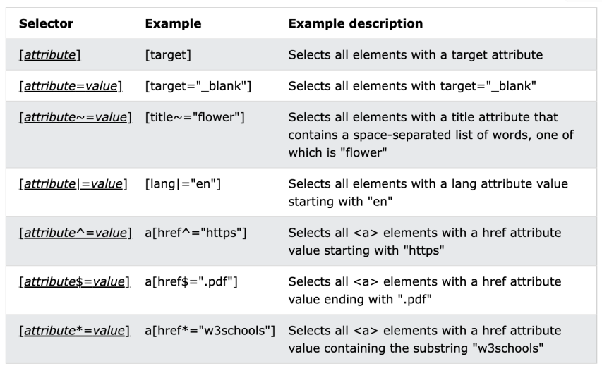

CSS
• Standard W3C
• Definisce la presentazione del documento HTML (o
in generale XML)
– Cioè come un documento viene visualizzato in contesti diversi
• CSS è un linguaggio indipendente con la sua
sintassi

Perché CSS
• Controllo fine di carattere e layout
– a livello del mondo della stampa
• Meno lavoro
– cambio l'aspetto di molte pagine in un solo foglio di stile
• Migliore accessibilità
– nell'html è rimasto solo il contenuto semantico
• Supportato da tutti i browser

Regole CSS
Una regola CSS è formata da:
• Selector (Selettore)
– identifica l'elemento o gli elementi a cui applicar lo stile
• Declaration (Dichiarazione)
– costituita da una coppia proprietà valore separati dai :
– fornisce l'istruzione di rendering
– ogni dichiarazione è delimitata da un ;

Come funziona
1. Scrivere un documento HTML
2. Scrivere le regole CSS
3. "Aggancio" le regole all'HTML
• Il browser visualizza lo stile definito

Stili nel head
• External style sheet
– collegato mediante il tag <link>
– file txt con estensione .css dove scriviamo le regole
• Internal style element
– regole nell'head tra i tag <style>

Elemento <link>
• Allega un file alla pagina corrente
– va posizionato nella sezione head del file html
• CSS
• Favicon

Stile Inline
<h1 style="color: red;">Prova</h1>
• Definisco lo stile usando l'attributo style
– Viene applicata solo all'elemento
– dichiarazioni multiple separate con ;
• Non andrebbe mai usato perché mischiano la struttura con
la presentazione!!!
– Si usa in casi molto particolari
• per fare override mirati di regole esterne

Selettore elemento
• Seleziono tutti gli elementi di quel tipo
Esempio: seleziono tutti i p
p {
    color: red;
}

Selettore classe
• Seleziono tutti gli elementi di una classe
– li individuo con l'attributo class ed un identificatore
– uso come selettore l'identificatore preceduto dal punto
.center{
    color: red;
}

Selettore id
• Seleziono l'elemento con quell'id
– scrivo l'id preceduto dal cancelletto (#)
#para1{
    color:red;
}

Raggruppare selettori
• Si possono anteporre più selettori ad un blocco di
dichiarazioni
h1, p{
    color:red;
}

Relazioni nel DOM
• Descendant - discendenti
– Gli elementi contenuti in un
elemento sono i suoi
discendenti
• Child - figli
– Discendenti diretti e viceversa
si dice genitore (parent)
• Ancestor - antenati
– Gli elementi sopra nell'albero
• Parent – genitore
– Elementi direttamente sopra
• Sibling – fratelli
– Elementi con lo stesso parent

Selettori composti
1. Selettori per descendant (spazio)
2. Selettori per child (>)
3. Selettori per Adjacent sibling (+)
– il fratello immediatamente successivo
4. Selettori per General sibling (~)
– tutti i fratelli successivi

Selezionare i child
• Tutti i p figli diretti (child) di un div
div > p{
    color:red;
}

Selezionare fratelli
div + p{
    color: red;
}
• Tutti gli elementi p immediatamente successivi ad un div
div ~ p{
    color:red;
}
• Tutti gli elementi p fratelli successivi degli elementi div

Pseudo Classi
• Una pseudo-classe viene utilizzata per definire uno stato
speciale di un elemento.
– mouse over
– visited e unvisited link
– focus
a:hover viene indicato con i :

Pseudo elementi
• Uno pseudo-elemento viene utilizzato per dare
uno stile alle parti specifiche di un elemento.
– Disegna la prima lettera o riga di un elemento
– Inserire un contenuto prima o dopo un elemento
Selettori
– ::after
– ::before
– ::first-letter
– ::first-line
– ::selection
viene indicato con i ::

Selettori con attributi
• È possibile impostare lo stile di elementi HTML con
attributi o valori di attributo specifici
[attribute] {
property: value;
}
è possibile selezionare parte del valore:
– parola, inizio, fine, etc.

Alcune proprietà sono ereditate dai discendenti.
Dichiarazioni ereditate
• Gli stili relativi ai font sono ereditati dai
descendant

Conflitti
• I conflitti di dichiarazione sono la normalità
– Posso applicare più stili allo stesso elemento
– Alcune proprietà le eredito
Domina quello più vicino all'elemento ma non sempre è cosi perché Non tutti i selettori sono uguali, alcuni hanno più "peso" di altri

Classi multiple: posso applicare più classi ad un singolo elemento

Se non voglio che una regola
venga sovrascritta la posso
dichiarare !important
• Viene usato in casi molto
particolari

Cascade
• Il Cascade "cascata" è un algoritmo che definisce
come combinare valori di proprietà provenienti da
fonti diverse.
• Stili:
– browser - user-agent stylesheets
– author - quello che scriviamo noi
– reader - the user of the browser, may have a custom style sheet
to tailor its experience

Calcolo della specificità
• Ad ogni dichiarazione è attribuita una specificità
misurata con quattro valori [a,b,c,d]
– ogni valore è indipendente dagli altri
– "a" è il valore più importante e "d" il meno importante
– si confrontano i valori più importanti e se uguali si passa a quelli
successivi altrimenti termina

Calcolo dei valori
a. 1 se la dichiarazione è inline, 0 altrimenti
b. numero di selettori id
c. numero di selettori di classe, attributo o pseudo-classe
d. numero di selettori elemento o pseudo elemento