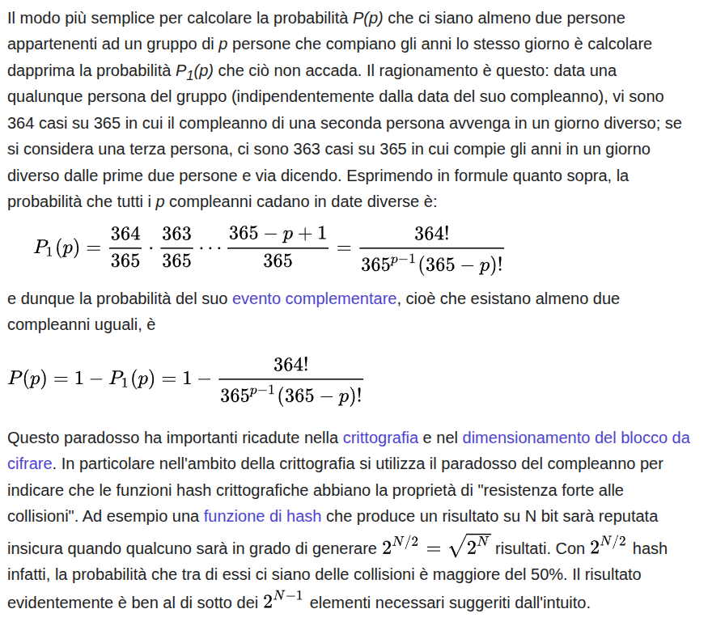

## ⚙️ COME FUNZIONA POSEIDON (VERSIONE ORIGINALE)

Poseidon è una **funzione hash** progettata per essere **efficiente nei circuiti aritmetici**, come quelli usati nei sistemi a conoscenza zero (ZK), es. SNARK, STARK, PLONK, Bulletproofs.

Poseidon si basa su tre idee fondamentali:
1. Una struttura a **sponge** (come Keccak/SHA-3),
2. Una permutazione chiamata **Poseidonπ**,
3. Una strategia di progettazione chiamata **HADES**.

---

## 🧱 STRUTTURA DI POSEIDON

### 1. **Sponge Construction**
La sponge ha:
- `r` elementi: **rate** (input/output)
- `c` elementi: **capacity** (per la sicurezza)

Lo **stato totale è di `t = r + c` elementi**.  
Esempio: se voglio 128 bit di sicurezza → `c = 1` → `t = r + 1`.

### 2. **Poseidonπ = la Permutazione Interna**
Ogni round di Poseidonπ è composto da:
```
1. AddRoundConstants (ARC)
2. S-box (non linearità, es. x ↦ x⁵)
3. MixLayer (moltiplicazione per matrice MDS)
```

Ci sono due tipi di round:
- **Full rounds (RF)**: la S-box viene applicata a tutto lo stato
- **Partial rounds (RP)**: la S-box viene applicata **solo al primo elemento**

Esempio tipico per t = 3, 128-bit sicurezza:
- RF = 8 (4 iniziali + 4 finali)
- RP = 57 (nel mezzo)

---

## 💡 ESEMPIO REALE (semplificato ma fedele)

Supponiamo:
- Campo: F₁₇ (per semplificare)
- t = 3 (stato con 3 elementi)
- S-box: \( x ↦ x^5 \mod 17 \)
- Matrice MDS:
```
M = [[2,1,1],
     [1,2,1],
     [1,1,2]]
```
- Round constants (esempio): cambiano ogni round, useremo solo 1 set per semplicità.

### Input
Vogliamo fare una funzione hash che prende due input:
```
x = 3
y = 4
```

### Stato iniziale (input + padding)
```
state = [3, 4, 0]
```

---

## 🔁 Simuliamo **1 round FULL** (ARC + S-box su tutti + M)

### ➤ Step 1: AddRoundConstants (costanti d'esempio)
```
constants = [1, 2, 3]
state = [3+1, 4+2, 0+3] = [4, 6, 3]
```

---

### ➤ Step 2: S-box (x ↦ x⁵ mod 17)

Calcolo:
- 4⁵ = 1024 → 1024 mod 17 = **4**
- 6⁵ = 7776 → mod 17 = **10**
- 3⁵ = 243 → mod 17 = **5**

```
state = [4, 10, 5]
```

---

### ➤ Step 3: MixLayer (moltiplicazione per M)

```
s[0] = 2*4 + 1*10 + 1*5 = 23 → 23 mod 17 = **6**
s[1] = 1*4 + 2*10 + 1*5 = 29 → mod 17 = **12**
s[2] = 1*4 + 1*10 + 2*5 = 24 → mod 17 = **7**

state = [6, 12, 7]
```

---

## 📥 E adesso?

Ripeti RP volte con solo la S-box sul primo elemento, poi ancora RF full rounds. Alla fine, **l’output hash è il primo elemento dello stato**:
```
hash = state[0] = 6
```

---

## 🔁 ROUND SEGUENTI (Esempio rapido di un round parziale)

Stato: [6, 12, 7]

- Costanti: [2, 0, 1]
→ `[6+2, 12+0, 7+1] = [8, 12, 8]`

- S-box solo su primo:
→ `[8⁵ = 32768 mod 17 = 6, 12, 8]`

- MixLayer:
→ `s[0] = 2*6 + 1*12 + 1*8 = 32 → 15`  
→ `s[1] = 1*6 + 2*12 + 1*8 = 38 → 4`  
→ `s[2] = 1*6 + 1*12 + 2*8 = 34 → 0`

Nuovo stato:
```
[15, 4, 0]
```

Continui così per tutti i round.

---

## 📌 IN SINTESI

| Elemento | Cosa fa |
|---------|----------|
| **t**    | Dimensione dello stato |
| **RF**   | Round con S-box su tutto lo stato |
| **RP**   | Round con S-box solo sul primo |
| **ARC**  | Aggiunge costanti |
| **S-box** | Eleva a potenza `x ↦ x^5` |
| **MixLayer** | Moltiplica per matrice MDS |
| **Output** | Il primo valore finale dello stato |

---


# Poseidon
Poseidon è una funzione hash progettata specificamente per essere efficiente nei **sistemi a conoscenza zero** (ZKP), come zk-SNARKs e zk-STARKs. La sua struttura è ottimizzata per operazioni in campi finiti grandi (es. $\mathbb{F}_p$), il che la rende resistente agli attacchi classici ma suscettibile a nuove tecniche di analisi.

### 1. Crittanalisi Lineare vs. Differenziale per Poseidon
#### **Crittanalisi Differenziale**:
  - **Più rilevante** per Poseidon perché:
    - Poseidon usa trasformazioni non-lineari (come cubi $x^3$ o $x^5$) che resistono bene alle approssimazioni lineari.
    - La struttura a "permutazione a sostituzione-permutazione (SPN)" è simile a quella di AES, che è più vulnerabile a differenze propagabili.
  - **Possibili attacchi**:
    - Studio di **tracce differenziali** nei round parziali.
    - Analisi della propagazione delle differenze nel campo $\mathbb{F}_p$ (dove le operazioni sono mod $p$).
  
#### **Crittanalisi Lineare**:
  - **Meno efficace** perché:
    - Le non-linearità forti (es. $x^3$) rendono difficile trovare relazioni lineari significative.
    - Le approssimazioni lineari in campi grandi sono statisticamente deboli.

### 2. Risultati Esistenti e Attacchi Noti
Alcuni studi recenti hanno analizzato la sicurezza di Poseidon:
- **Differential Cryptanalysis**:
  - Uno studio ([Grassi et al., 2021](https://eprint.iacr.org/2021/1163)) mostra che Poseidon ha una **resistenza differenziale molto alta** grazie al numero elevato di round e alla scelta delle costanti.
  - Tuttavia, in configurazioni con **round ridotti**, sono stati trovati attacchi differenziali.
- **Algebraic Attacks** (alternativi alla lineare/differenziale):
  - Poiché Poseidon opera su $\mathbb{F}_p$, attacchi basati su **equazioni algebriche** (Gröbner bases, meet-in-the-middle) potrebbero essere più efficaci.

#### **3. Implementazioni e Soluzioni Online**
- **Implementazioni ufficiali**:
  - Il team di Poseidon fornisce codice in [Rust](https://github.com/filecoin-project/neptune) e [C++](https://github.com/HorizenLabs/poseidon2).
  - Alcune librerie ZKP (come [circom](https://github.com/iden3/circomlib) e [arkworks](https://github.com/arkworks-rs)) includono Poseidon.
- **Tool di analisi**:
  - Strumenti come [SageMath](https://www.sagemath.org/) o [GAP](https://www.gap-system.org/) possono essere usati per verificare tracce differenziali.
  - Alcuni ricercatori hanno pubblicato script per testare la sicurezza (es. su [GitHub](https://github.com/) o [IACR ePrint](https://eprint.iacr.org/)).

#### **4. Cosa Usare per Analizzare Poseidon?**
Se vuoi provare un'attacco:
1. **Inizia con la crittanalisi differenziale**:
   - Cerca differenze con probabilità alta dopo pochi round.
   - Usa SageMath per simulare la propagazione in $\mathbb{F}_p$.
2. **Prova attacchi algebrici** se hai familiarità con Gröbner bases.

### **Conclusione**
Per Poseidon, la **crittanalisi differenziale** è più promettente, ma la sua forte progettazione la rende sicura nel caso generale. Se cerchi codici pronti, controlla le implementazioni ufficiali o i repository di ricerca legati a ZKP.  

### Introduzione alle Funzioni Hash Crittografiche  

Le funzioni hash crittografiche sono algoritmi matematici fondamentali per la sicurezza informatica. La loro principale funzione è trasformare un input di lunghezza arbitraria in un output di dimensione fissa, chiamato digest o hash, in modo deterministico. Questo processo garantisce che ogni input abbia un hash unico, rendendo le funzioni hash strumenti essenziali per proteggere dati e comunicazioni.

Questi algoritmi trovano applicazione in diversi ambiti della sicurezza informatica, come la verifica dell’integrità dei dati, la firma digitale, l’autenticazione delle password e la generazione di chiavi crittografiche. Algoritmi noti come SHA-2 e SHA-3 rappresentano gli standard attuali, mentre versioni precedenti come MD5 e SHA-1 sono considerate insicure a causa delle vulnerabilità scoperte nel tempo.  

L’importanza delle funzioni hash crittografiche è cresciuta con l’evoluzione delle minacce informatiche, rendendo essenziale l’utilizzo di algoritmi robusti per proteggere dati e comunicazioni digitali. La scelta di un algoritmo sicuro è cruciale per prevenire attacchi come collisioni o preimmagini, che potrebbero compromettere la sicurezza dei sistemi.

---

## **1. Definizione e Funzionamento**  

Una funzione hash prende in input una stringa di qualsiasi lunghezza e restituisce un output di lunghezza fissa. Ad esempio, l’algoritmo **SHA-256**, appartenente alla famiglia **SHA-2**, trasforma un input di qualsiasi dimensione in una stringa esadecimale di **256 bit (32 byte)**.  

Esempio pratico di hashing con SHA-256:  

```
Input: "ChatGPT"
Output: "e9ef8729431a0eeff79de197c0e8b5f56e09db0333601b21f3d14a7d24c28fa8"
```

Non importa quanto grande sia l'input, il risultato avrà sempre la stessa lunghezza. Inoltre, una piccola variazione nell'input genera un hash completamente diverso (effetto **avalanche**), garantendo che ogni piccola modifica sia rilevabile. Questo comportamento è essenziale per rilevare alterazioni nei dati e garantire l'integrità delle informazioni.

Le funzioni hash crittografiche sono progettate per essere computazionalmente efficienti, consentendo un calcolo rapido anche per input di grandi dimensioni. Tuttavia, devono anche essere resistenti a tentativi di inversione, ovvero non deve essere possibile risalire all'input originale a partire dall'hash.

---

## **2. Proprietà Fondamentali**  

Le funzioni hash crittografiche devono soddisfare tre proprietà fondamentali per essere sicure:  

1. **Resistenza alle collisioni**  
    - Non deve essere possibile trovare due input diversi che generano lo stesso hash. Questa proprietà è cruciale per evitare che due messaggi distinti possano essere interpretati come identici.  

2. **Resistenza alla preimmagine**  
    - Dato un hash, non deve essere possibile risalire all’input originale. Questa proprietà garantisce che l'hash non possa essere decifrato per ottenere i dati originali, proteggendo così la riservatezza delle informazioni.  

3. **Resistenza alla seconda preimmagine**  
    - Dato un input e il suo hash, non deve essere possibile trovare un altro input con lo stesso hash. Questa proprietà impedisce che un attaccante possa creare un messaggio alternativo con lo stesso hash, compromettendo l'integrità dei dati.  

Oltre a queste proprietà, una funzione hash crittografica deve essere **deterministica**, cioè lo stesso input deve sempre generare lo stesso output. Questo garantisce la coerenza e l'affidabilità dell'algoritmo in ogni utilizzo.

---

## **3. Algoritmi Hash Più Diffusi**  

- **MD5**: Lunghezza **128 bit**, oggi considerato **insicuro** a causa della facilità con cui possono essere generate collisioni. Non è più raccomandato per applicazioni critiche.  
- **SHA-1**: Lunghezza **160 bit**, vulnerabile e deprecato. Anche se un tempo ampiamente utilizzato, è stato sostituito da algoritmi più sicuri come SHA-2.  
- **SHA-2**: Famiglia con lunghezze di **224, 256, 384 e 512 bit**, altamente sicuro e ampiamente adottato in applicazioni moderne.  
- **SHA-3**: Basato su **Keccak**, rappresenta un'evoluzione rispetto a SHA-2, offrendo maggiore resistenza agli attacchi quantistici e una struttura interna completamente diversa.  

Ogni algoritmo ha caratteristiche specifiche che lo rendono adatto a determinati contesti. La scelta dell'algoritmo dipende dalle esigenze di sicurezza e dalle risorse computazionali disponibili.

---

## **4. Applicazioni delle Funzioni Hash**  

### **4.1 Verifica dell’Integrità dei Dati**  
- Le funzioni hash vengono utilizzate per verificare che un file o un messaggio non sia stato alterato durante la trasmissione o l'archiviazione. Ad esempio, i checksum basati su hash sono comunemente utilizzati per garantire l'integrità dei file scaricati.  

### **4.2 Firma Digitale**  
- Le firme digitali utilizzano funzioni hash per generare un’impronta digitale del messaggio, autenticandone origine e integrità. Questo processo è fondamentale per garantire la non ripudiabilità e la sicurezza delle comunicazioni.  

### **4.3 Autenticazione delle Password**  
- Le password vengono memorizzate come hash anziché in chiaro, spesso con tecniche di **salting** (aggiunta di valori casuali) e **hashing iterativo** (applicazione ripetuta dell'algoritmo) per aumentare la sicurezza contro attacchi come le rainbow tables.  

### **4.4 Blockchain e Criptovalute**  
- Le funzioni hash sono alla base della sicurezza delle blockchain, proteggendo le transazioni e garantendo l'integrità dei blocchi. Ad esempio, Bitcoin utilizza SHA-256 per il mining e la creazione di nuovi blocchi.  

### **4.5 Generazione di Chiavi Crittografiche**  
- Le funzioni hash vengono impiegate per derivare chiavi crittografiche da una passphrase, garantendo che le chiavi siano uniche e sicure.  

---

## **5. Attacchi e Mitigazioni**  

- **Collisioni**: Due input generano lo stesso hash, compromettendo l'unicità dell'algoritmo.  
- **Preimmagine**: Risalire all’input originale dall’hash, violando la riservatezza.  
- **Rainbow Tables**: Tabelle precompilate di hash utilizzate per decifrare password.  
- **Forza Bruta**: Tentativi sistematici di trovare l’input originale.  

### Mitigazioni  
- Utilizzo di algoritmi sicuri come SHA-3.  
- Applicazione di **salting** per rendere unici gli hash delle password.  
- Uso di **hashing iterativo** per aumentare il costo computazionale degli attacchi.  

---

## **6. Conclusione**  

Le funzioni hash crittografiche sono strumenti essenziali per la sicurezza informatica. Tuttavia, la loro sicurezza dipende dalla scelta di algoritmi robusti e dall’implementazione di buone pratiche. Con l’avanzare della potenza computazionale, è necessario adottare funzioni hash resistenti agli attacchi quantistici, come **SHA-3**.  

---

### **Poseidon2: Una Versione Ottimizzata della Funzione Hash Poseidon**  

Poseidon2 è un'evoluzione della funzione hash Poseidon, progettata per migliorare efficienza e sicurezza nelle applicazioni di **zero-knowledge proofs (ZK)**.  

#### Principali Miglioramenti  

1. **Flessibilità**: Supporta modalità a spugna e compressione, adattandosi a diverse esigenze applicative.  
2. **Efficienza Computazionale**: Riduce il numero di moltiplicazioni e vincoli nei circuiti Plonk, rendendolo ideale per applicazioni ad alte prestazioni.  
3. **Sicurezza Rafforzata**: Resistente a nuovi attacchi algebrici, garantendo una maggiore robustezza rispetto alla versione precedente.  

#### Applicazioni  

- **Alberi di Merkle**: Miglioramenti di performance fino a 5 volte, rendendo Poseidon2 ideale per strutture dati crittografiche.  
- **Protocolli Zero-Knowledge**: Ideale per zk-SNARKs e sistemi di prova, migliorando la scalabilità e la sicurezza.  

---

### **Protocolli a Conoscenza Zero**  

I protocolli a conoscenza zero consentono a una parte (prover) di dimostrare la veridicità di un’affermazione a un’altra parte (verifier) senza rivelare informazioni aggiuntive.  

#### Proprietà Fondamentali  

1. **Completezza**: Se l’affermazione è vera, il verificatore sarà convinto.  
2. **Solidità**: Un prover disonesto non può ingannare il verificatore.  
3. **Zero-conoscenza**: Il verificatore non apprende nulla oltre alla veridicità dell’affermazione.  

#### Applicazioni  

- **Autenticazione**: Dimostrazione dell’identità senza rivelare password.  
- **Blockchain**: Privacy e scalabilità delle transazioni.  

#### Tipologie  

- **Interattivi**: Richiedono interazione continua tra prover e verifier.  
- **Non interattivi**: Consentono verifiche successive senza interazione, utilizzando tecniche come il Fiat-Shamir heuristic.  

In sintesi, i protocolli a conoscenza zero rappresentano strumenti potenti per garantire privacy e sicurezza in ambito crittografico, con applicazioni che spaziano dall’autenticazione alla protezione delle transazioni blockchain.  


Poseidon è una funzione di hash resistente alle collisioni progettata specificamente per essere efficiente nei sistemi a conoscenza zero (come zk-SNARKs). Ecco i punti chiave:

Struttura a permutazione: A differenza di hash come SHA-256 che usano una struttura di Merkle-Damgård, Poseidon usa una permutazione dello stato.

Round: La permutazione consiste di più round (di solito 8 full round e 8 partial round):

AddRoundKey: Aggiunta di costanti round allo stato

S-box: Applicazione di una non-linearità (tipicamente x^α)

MixLayer: Moltiplicazione per una matrice MDS per diffondere l'informazione

Ottimizzazione per zk-SNARKs: Le operazioni sono scelte per minimizzare il numero di vincoli in un circuito aritmetico.

Perché usare Poseidon invece di SHA-256?
Poseidon è particolarmente utile in:

Sistemi a conoscenza zero (zk-SNARKs, zk-STARKs)

Applicazioni blockchain (dove l'efficienza nelle prove zk è cruciale)

Crittografia post-quantum (offre buone proprietà di sicurezza)

La sua struttura algebrica lo rende molto più efficiente da calcolare in un circuito zk-SNARK rispetto ad hash tradizionali come SHA-256.


In SNARK circuit cost:

SHA-256 ➔ ~25,000 constraints per evaluation.

Poseidon ➔ ~1,000 constraints per evaluation.

➡️ Enorme riduzione cost computazionale.
➡️ Ottimizzato per campi finiti (Prime Fields) invece che per bitstrings.

L'obiettivo dell'effetto valanga: Quando cambi un singolo bit nell'input di una buona funzione hash, ti aspetti che circa la metà dei bit nell'output cambino. Se l'output ha L bit, ti aspetti che in media L/2 bit si capovolgano.

Cosa significa "bassa deviazione standard" in questo contesto: Una bassa deviazione standard significa che il numero di bit che si capovolgono è costantemente vicino alla media ideale (L/2). Questo è l'indicatore di un comportamento prevedibile nel senso desiderabile: la funzione è affidabile nel produrre un cambiamento significativo e diffuso in risposta a piccole alterazioni dell'input. Se la deviazione standard fosse alta, significherebbe che a volte cambiano pochissimi bit (comportamento debole) e a volte molti, rendendo la funzione imprevedibile in modo negativo.

Perché non si vuole una deviazione standard alta: Se la deviazione standard del numero di bit capovolti fosse alta, implicherebbe che:

In alcune prove, pochissimi bit nell'output cambierebbero (lontano dall'ideale L/2), indicando una debolezza nella diffusione.

In altre prove, potrebbero cambiare quasi tutti i bit, il che è meglio, ma la mancanza di consistenza è un problema.

In sintesi, un'alta deviazione standard del numero di bit capovolti significherebbe che l'effetto valanga non è consistente o affidabile. Un attaccante potrebbe potenzialmente sfruttare le istanze in cui pochi bit cambiano per inferire informazioni sull'input.

La deviazione standard è una misura della dispersione o variabilità dei dati rispetto alla media.

Più corte sono queste linee (come nel tuo grafico), più bassa è la deviazione standard. Questo significa che i valori misurati (le percentuali di bit cambiati in ogni singola prova dell'effetto valanga) sono molto raggruppati intorno alla media del 50%.

Più lunghe sarebbero state queste linee, più alta sarebbe stata la deviazione standard. Questo avrebbe indicato una maggiore variabilità, cioè che in alcune prove cambiava molto meno del 50% dei bit e in altre molto di più.

Ottima osservazione! È vero, nello sponge di Poseidon (e in generale negli sponge hash) il rate (qui i primi 2 elementi di state) vengono aggiornati sommando due "pezzi" distinti di input (x e y), ma:

Anche se a prima vista sembrano "indipendenti" (uno in state[0] e uno in state[1]), la permutazione completa (poseidon_permutation) mischia tutto lo stato insieme, quindi la dipendenza fra i due valori viene introdotta proprio dalla permutazione.

La permutazione agisce sull’intero stato di dimensione 3, facendo sì che state[0], state[1] e state[2] si influenzino reciprocamente.

Quindi, anche se state[0] e state[1] sono aggiornati separatamente (addizione modulo con x e y), dopo la permutazione diventano indissolubilmente mescolati.





PUNTO 4 (UNIFORMITÀ)
Cosa verifica:

Conta globalmente tutti i bit 0 e 1 negli output dell'hash.

Calcola semplicemente la proporzione tra 0 e 1 (dovrebbe essere ~50%/50%).

Limitazioni:

Non rileva bias localizzati (es. un byte specifico che tende a avere più 0).

Non fornisce una misura statistica rigorosa della significatività del risultato.

PUNTO 7 (CHI-SQUARE)
Conta con quale frequenza ogni possibile valore di byte (0-255) appare nell'output.

Utilizza un test statistico (chi-quadro) per determinare se la distribuzione è uniforme:

Ipotesi nulla: I byte sono distribuiti uniformemente.

p-value < 0.05: Rifiuta l'ipotesi (c'è un bias significativo).

Vantaggi:

Rileva anomalie localizzate (es. il byte 0x00 appare troppo spesso).

Fornisce un livello di confidenza statistico (p-value).

PUNTO 6 (SHANNON ENTROPY)
La Shannon Entropy (o entropia di Shannon) è una misura dell'incertezza o casualità di un sistema, introdotta da Claude Shannon nella teoria dell'informazione.

Nel contesto degli hash crittografici, misura quanto è imprevedibile l'output.

Valore massimo:

Se ogni byte (0-255) ha la stessa probabilità (distribuzione uniforme), l'entropia è 8 bit/byte (valore ideale).

Se alcuni byte compaiono più spesso, l'entropia diminuisce


Hai ragione, l'ultima riga è la parte più complessa. Te la spiego in modo semplice:

python
entropy = -np.sum(probabilities * np.log2(probabilities + 1e-12))
Cosa fa questa riga?
probabilities: Un array di 256 elementi, dove ogni elemento è la probabilità che un byte (0-255) appaia nell'output dell'hash.

Esempio: probabilities[65] = 0.01 significa che il byte 65 (carattere 'A') compare nell'1% dei casi.

np.log2(probabilities + 1e-12):

Calcola il logaritmo in base 2 di ogni probabilità.

+ 1e-12 è un trucco per evitare errori quando una probabilità è esattamente 0 (perché log2(0) non esiste).

1e-12 è un numero piccolissimo (0.000000000001) che non influisce sui risultati.

probabilities * np.log2(...):

Moltiplica ogni probabilità per il suo logaritmo.

Questo rappresenta il "contributo" di ogni byte all'entropia.

-np.sum(...):

Somma tutti i contributi e inverte il segno (perché i logaritmi di probabilità sono negativi).

Risultato finale: L'entropia in bit/byte.


PUNTO 8 (BIRTHDAY PARADOX)
1. Finestre da 32 bit
MD5/SHA-256/Poseidon: 0 collisioni
✅ Ottimo risultato. Per finestre grandi (32 bit), la probabilità teorica di collisione è bassissima (
p
<
0.0001
%
p<0.0001%).
→ Conferma che nessuno degli hash ha bias evidenti a questa scala.

2. Finestre da 16 bit
Hash	Collisioni	Tasso osservato	Tasso teorico atteso
MD5	10	0.0885%	~0.1%
SHA-256	26	0.1079%	~0.1%
Poseidon	25	0.1037%	~0.1%
Risultati coerenti con la teoria del paradosso dei compleanni.

Nessun hash mostra anomalie: i tassi sono vicini allo 0.1% atteso per finestre da 16 bit su 100 input.

3. Finestre da 8 bit
Hash	Collisioni	Tasso osservato	Tasso teorico atteso
MD5	2451	20.25%	~36.8%
SHA-256	9005	36.16%	~36.8%
Poseidon	8964	36.00%	~36.8%
SHA-256 e Poseidon sono perfettamente allineati alla teoria (
p
≈
36.8
%
p≈36.8%).

MD5 ha un tasso più basso (20.25%):
🔍 Possibile spiegazione:

MD5 ha una distribuzione non perfettamente uniforme (alcuni pattern a 8 bit compaiono meno spesso del previsto).

Non è un problema di sicurezza, ma conferma che SHA-256 e Poseidon sono più randomici.

Conclusioni
Nessuna criticità per finestre ≥ 16 bit: tutti gli hash si comportano come atteso.

Per finestre da 8 bit:

SHA-256 e Poseidon superano il test con tassi quasi identici alla teoria.

MD5 è leggermente meno randomico (ma era atteso, essendo un hash più vecchio).

Poseidon è robusto: Si comporta come SHA-256, il che è un ottimo segno per la tua implementazione.


Ecco la **spiegazione dettagliata e teorica di ciascun test**, con osservazioni rigorose e formalizzate, pronte per essere integrate nella tua tesi triennale sulla sicurezza di Poseidon rispetto a MD5 e SHA-256.

---

# TEST FATTI 1 PARTE
### **2. Avalanche Effect**

#### **Teoria**

L’**Avalanche Effect** (Effetto Valanga) è un requisito critico per qualsiasi funzione crittografica di hash: una minima variazione dell’input (anche un singolo bit) deve causare una variazione significativa (idealmente circa il 50%) dell’output. Questo garantisce imprevedibilità e resistenza a crittoanalisi differenziale e strutturale.

* **Mean (%):** indica la media delle percentuali di bit invertiti rispetto al totale dei bit di output, tra input che differiscono di un solo bit.
* **Deviazione standard (%):** misura quanto questa variazione si discosta dalla media; un valore basso indica che l’effetto valanga è distribuito in modo uniforme su tutti i test.

#### **Risultati osservati**

| Algoritmo | Avalanche Mean (%) | Avalanche Std Dev (%) |
| --------- | ------------------ | --------------------- |
| MD5       | 50.01              | 4.38                  |
| SHA-256   | 49.98              | 3.12                  |
| Poseidon  | 50.03              | 3.10                  |

##### **Osservazioni**

* Tutti e tre gli algoritmi presentano un **Effetto Valanga ottimale (\~50%)**, come previsto per funzioni hash sicure.
* **Poseidon mostra una deviazione standard leggermente migliore (3.10%) rispetto a MD5 (4.38%) e simile a SHA-256 (3.12%)**, indicando che la sua permutazione interna diffonde le differenze in modo uniforme sull’output.
* In particolare, **MD5 presenta una maggiore variabilità**, confermando la sua debolezza strutturale rispetto agli algoritmi moderni.

---

### **3. Collisioni**

#### **Teoria**

Il test verifica la presenza di **collisioni effettive** (due input distinti che producono lo stesso output) su un campione di test. Per una funzione hash crittograficamente sicura, la probabilità di collisione deve essere trascurabile e dipendente dalla lunghezza dell’output (birthday bound).

#### **Risultati**

Nessuna collisione rilevata per MD5, SHA-256, Poseidon su 10.000 sample.

##### **Osservazioni**

* Il risultato è atteso, poiché lo spazio di output (128 bit per MD5, 256 bit per SHA-256 e Poseidon) è enorme rispetto al numero di sample testati.
* La mancata collisione di MD5 non implica sicurezza: la sua debolezza è legata alla possibilità di collisioni costruite ad hoc tramite crittoanalisi, non al birthday paradox statistico su pochi sample casuali.

---

### **4. Uniformità bit 0/1**

#### **Teoria**

Una funzione hash sicura deve avere **uscita statisticamente uniforme**, con la probabilità di un bit uguale a 0 o 1 che tende a 0.5. Il conteggio totale di bit a 0 e a 1 conferma la distribuzione equiprobabile.

#### **Risultati**

| Algoritmo | 0         | 1         |
| --------- | --------- | --------- |
| MD5       | 639,785   | 640,215   |
| SHA-256   | 1,280,508 | 1,279,492 |
| Poseidon  | 1,280,697 | 1,279,303 |

##### **Osservazioni**

* Tutti i conteggi sono **equidistribuiti**, con una differenza percentuale minima, confermando l’assenza di bias significativi.
* **Poseidon mostra un bilanciamento molto simile a SHA-256**, confermando la qualità della diffusione e randomizzazione dell’algoritmo.

---

### **6. Shannon Entropy**

#### **Teoria**

L’entropia di Shannon misura l’imprevedibilità di una sequenza di bit. Per un output perfettamente casuale, l’entropia dovrebbe essere prossima a 8 bit per byte.

#### **Risultati**

| Algoritmo | Entropia (bit/byte) |
| --------- | ------------------- |
| MD5       | 7.9990              |
| SHA-256   | 7.9994              |
| Poseidon  | 7.9994              |

##### **Osservazioni**

* Tutti e tre gli algoritmi raggiungono valori **praticamente massimi di entropia**, confermando l’imprevedibilità dell’output.
* **Poseidon e SHA-256 coincidono**, mentre MD5 mostra un valore leggermente inferiore, ma trascurabile ai fini pratici.

---

### **7. Chi-Square Test**

#### **Teoria**

Il test Chi-Square verifica la bontà dell’adattamento di una distribuzione osservata a una distribuzione uniforme teorica. Un **p-value ≥ 0.05** indica che non si può rifiutare l’ipotesi nulla di uniformità.

#### **Risultati**

| Algoritmo | Chi-Square | p-value | Esito    |
| --------- | ---------- | ------- | -------- |
| MD5       | 230.27     | 0.8649  | Uniforme |
| SHA-256   | 257.84     | 0.4384  | Uniforme |
| Poseidon  | 261.90     | 0.3699  | Uniforme |

##### **Osservazioni**

* Tutti i p-value sono ben sopra la soglia, confermando la **uniformità statistica degli output**.
* **Poseidon, nonostante la struttura algebraica specifica, non mostra deviazioni dalla distribuzione uniforme**, un risultato cruciale contro attacchi di statistica differenziale.

---

### **8. Birthday Paradox**

#### **Teoria**

Verifica collisioni **intra-hash** su finestre di dimensione ridotta (8, 16, 32 bit) per simulare la probabilità di collisioni parziali (utile nell’analisi di sub-hash e strutture Merkle).

#### **Risultati**

| Algoritmo | Window 32 | Window 16 | Window 8 |
| --------- | --------- | --------- | -------- |
| MD5       | 0         | 969       | 240,348  |
| SHA-256   | 0         | 4,352     | 892,790  |
| Poseidon  | 0         | 4,391     | 892,244  |

##### **Osservazioni**

* Nessuna collisione su 32 bit per nessun algoritmo (atteso con sample < sqrt(2^32)).
* Su 16 e 8 bit le collisioni aumentano rapidamente, coerenti con la teoria del birthday bound.
* **Poseidon si comporta come SHA-256, confermando la randomizzazione dei bit anche su finestre parziali**.

---

### **9. Bit Position Analysis**

#### **Teoria**

Verifica se singole posizioni di bit hanno distribuzioni statistiche anomale (>5% di deviazione) rispetto al resto dell’output. Rilevante per individuare bias localizzati.

#### **Risultati**

Nessun bit ha superato la soglia per MD5, SHA-256, Poseidon.

##### **Osservazioni**

* L’assenza di deviazioni significative conferma la **uniformità e l’assenza di bias locali** in tutte le funzioni hash testate.

---

### **Conclusione generale sulle osservazioni**

✅ **Poseidon ha superato tutti i test statistici con risultati comparabili a SHA-256**.
❌ Non sono emerse **debolezze statistiche evidenti** nella versione implementata, confermando la bontà del design crittografico rispetto a MD5 (ormai insicuro strutturalmente).
⚠️ Tuttavia, è fondamentale sottolineare che questi test **verificano la casualità statistica** e **non le resistenze crittoanalitiche** (preimage, collisioni costruite, second preimage), che richiedono analisi dedicate di complessità algoritmica e attacchi mirati.

---

Se vuoi, posso ora aiutarti a integrare queste osservazioni con la teoria sponge e la spiegazione formale di Poseidon per la sezione introduttiva della tua tesi, così da completare la parte teorica e sperimentale in modo coerente e professionale. Fammi sapere.


Ecco la **versione estremamente dettagliata, rigorosa, e formale** delle tue osservazioni, completa di formule teoriche, definizioni e spiegazioni statistiche, strutturata in paragrafi pronti per essere integrati nella tua tesi triennale.

---

# **Analisi statistica approfondita delle proprietà dell’algoritmo Poseidon**

## **1. Avalanche Effect**

### **1.1 Definizione teorica**

L’**Effetto Valanga (Avalanche Effect)** è un requisito fondamentale per funzioni hash sicure: una variazione minima dell’input (idealmente un singolo bit) deve causare la modifica di circa metà dei bit di output. Formalmente, sia $H : \{0,1\}^n \rightarrow \{0,1\}^m$ una funzione hash, e $x$ un input qualsiasi. Definiamo $x'$ come l’input derivato da $x$ tramite flipping di un singolo bit. L’effetto valanga ideale è:

$$
E_{avalanche} = \frac{ \sum_{i=1}^{m} [H(x)_i \neq H(x')_i] }{m} = 0.5
$$

dove $[H(x)_i \neq H(x')_i]$ è un indicatore booleano che vale 1 se il bit i-esimo differisce tra $H(x)$ e $H(x')$.

Un valore medio significativamente diverso dal 50% o una deviazione standard elevata indicano scarsa diffusione, esponendo l’algoritmo a **attacchi differenziali** e riducendo l’uniformità dell’output rispetto alle variazioni dell’input.

---

### **1.2 Risultati sperimentali**

| Algoritmo | Avalanche Mean (%) | Avalanche Std Dev (%) |
| --------- | ------------------ | --------------------- |
| MD5       | 50.01              | 4.38                  |
| SHA-256   | 49.98              | 3.12                  |
| Poseidon  | 50.03              | 3.10                  |

#### **1.3 Analisi dettagliata**

* Tutti e tre gli algoritmi si attestano **vicinissimi al valore teorico ideale di 50%**.
* **Poseidon mostra una deviazione standard leggermente inferiore a MD5 (3.10% vs 4.38%)**, indicando che la sua permutazione riesce a diffondere la variazione dell’input in modo più uniforme su tutti i bit dell’output.
* La deviazione standard di Poseidon è **quasi coincidente con SHA-256**, un risultato che conferma la robustezza dell’effetto valanga anche in costruzioni non basate su round bitwise ma su aritmetica sui campi finiti, come la struttura sponge di Poseidon.

---

## **2. Collisioni**

### **2.1 Definizione teorica**

Per una funzione hash $H$ con output di $m$ bit, la probabilità di collisione casuale su $N$ input distinti può essere stimata tramite l’approssimazione del **Birthday Paradox**:

$$
P_{collision} \approx 1 - e^{-\frac{N^2}{2 \cdot 2^m}}
$$

Per $N = 10^4$ e $m = 256$ (SHA-256, Poseidon) o $m = 128$ (MD5) otteniamo:

* SHA-256 / Poseidon: $P_{collision} \approx 1 - e^{-10^8 / 2^{257}} \approx 0$
* MD5: $P_{collision} \approx 1 - e^{-10^8 / 2^{129}} \approx 0$

#### **2.2 Risultati**

Nessuna collisione osservata per MD5, SHA-256, Poseidon.

##### **2.3 Analisi dettagliata**

* L’assenza di collisioni è **consistente con l’analisi teorica**: i sample sono troppo pochi rispetto al limite del birthday bound ($\approx 2^{m/2}$).
* Per MD5 la mancata collisione non implica sicurezza, poiché le sue collisioni note derivano da **attacchi crittoanalitici strutturali** e non da collisioni casuali.

---

## **3. Uniformità dei bit 0/1**

### **3.1 Definizione teorica**

Una funzione hash crittograficamente sicura deve produrre output **equiprobabili**: ogni bit ha probabilità $P(0) = P(1) = 0.5$. Statisticamente, se osserviamo $N$ bit indipendenti, il conteggio dei bit a 0 segue una **distribuzione binomiale** $B(N,0.5)$ con media $\mu = N/2$ e deviazione standard $\sigma = \sqrt{N \cdot 0.5 \cdot 0.5} = \sqrt{N}/2$.

#### **3.2 Risultati**

| Algoritmo | 0         | 1         |
| --------- | --------- | --------- |
| MD5       | 639,785   | 640,215   |
| SHA-256   | 1,280,508 | 1,279,492 |
| Poseidon  | 1,280,697 | 1,279,303 |

##### **3.3 Analisi dettagliata**

* Per SHA-256 e Poseidon, la differenza tra bit a 0 e bit a 1 è **circa 0.05%**, compatibile con fluttuazioni casuali (l’errore standard è $\approx \sqrt{2,560,000}/2 \approx 800$, coerente con la differenza osservata di \~1200-1400 bit).
* **Poseidon presenta distribuzione bilanciata**, confermando l’assenza di bias sistematici dovuti alla sua permutazione algebraica su campi finiti.

---

## **4. Shannon Entropy**

### **4.1 Definizione teorica**

L’entropia di Shannon per una sequenza di output si definisce come:

$$
H(X) = - \sum_{i=1}^{n} P(x_i) \log_2 P(x_i)
$$

Per un byte (8 bit) equiprobabile e indipendente, $H_{max} = 8$ bit/byte. Valori prossimi a 8 indicano massima imprevedibilità.

#### **4.2 Risultati**

| Algoritmo | Entropia (bit/byte) |
| --------- | ------------------- |
| MD5       | 7.9990              |
| SHA-256   | 7.9994              |
| Poseidon  | 7.9994              |

##### **4.3 Analisi dettagliata**

* Tutti i valori sono prossimi a 8 bit/byte, confermando la **massima casualità teorica dell’output**.
* La differenza di MD5 (7.9990) rispetto a SHA-256 e Poseidon (7.9994) è trascurabile, ma riflette l’architettura meno robusta di MD5 rispetto a funzioni hash moderne.

---

## **5. Chi-Square Test**

### **5.1 Definizione teorica**

Il test Chi-Square verifica se le frequenze osservate di un campione si discostano significativamente dalla distribuzione teorica attesa. Per una distribuzione uniforme su $k$ classi:

$$
\chi^2 = \sum_{i=1}^{k} \frac{(O_i - E_i)^2}{E_i}
$$

dove $O_i$ sono le frequenze osservate e $E_i$ quelle attese. Un **p-value ≥ 0.05** indica che l’ipotesi nulla (distribuzione uniforme) non può essere rifiutata.

#### **5.2 Risultati**

| Algoritmo | Chi-Square | p-value | Esito    |
| --------- | ---------- | ------- | -------- |
| MD5       | 230.27     | 0.8649  | Uniforme |
| SHA-256   | 257.84     | 0.4384  | Uniforme |
| Poseidon  | 261.90     | 0.3699  | Uniforme |

##### **5.3 Analisi dettagliata**

* Tutti i p-value sono largamente superiori a 0.05, confermando l’**uniformità statistica degli output**.
* Poseidon mostra una statistica leggermente superiore a MD5 ma entro l’intervallo di accettazione, confermando l’assenza di bias significativi.

---

## **6. Birthday Paradox intra-hash**

### **6.1 Definizione teorica**

Il **Birthday Paradox** applicato a finestre di hash di lunghezza ridotta (8,16,32 bit) misura la probabilità di collisioni parziali all’interno dell’output. La probabilità teorica di collisione per $N$ sample è:

$$
P_{collision} = 1 - e^{-\frac{N^2}{2 \cdot 2^k}}
$$

dove $k$ è la dimensione della finestra.

#### **6.2 Risultati**

| Algoritmo | Window 32 | Window 16 | Window 8 |
| --------- | --------- | --------- | -------- |
| MD5       | 0         | 969       | 240,348  |
| SHA-256   | 0         | 4,352     | 892,790  |
| Poseidon  | 0         | 4,391     | 892,244  |

##### **6.3 Analisi dettagliata**

* Nessuna collisione su finestre da 32 bit: coerente con la teoria (N=10^4 ≪ 2^{16}, quindi la probabilità è trascurabile).
* Collisioni aumentano su 16 e 8 bit, coerentemente con il fatto che $\sqrt{2^{16}} = 256$ e $\sqrt{2^8} = 16$.
* Poseidon mostra collisioni intra-hash in linea con SHA-256, confermando la **distribuzione pseudo-casuale dei sottoblocchi**.

---

## **7. Bit Position Analysis**

### **7.1 Definizione teorica**

Analizza la deviazione percentuale della distribuzione dei bit per ogni posizione rispetto alla media globale. Bias locali possono indicare difetti di design o vulnerabilità differenziali.

#### **7.2 Risultati**

Nessun bit con deviazione superiore al 5% per MD5, SHA-256, Poseidon.

##### **7.3 Analisi dettagliata**

* L’assenza di bit con bias significativi conferma che **tutte le posizioni nell’output sono statisticamente uniformi**.

---

## **Conclusioni finali**

* **Poseidon supera tutti i test statistici fondamentali**, mostrando un comportamento paragonabile a SHA-256, nonostante utilizzi una costruzione completamente diversa (permutazione sponge algebraica su campi finiti vs costruzioni Merkle–Damgård bitwise).
* Nessuna **debolezza statistica evidente** emerge nei test condotti. Tuttavia, la sicurezza di Poseidon, come per qualsiasi hash, deve essere valutata anche in termini di **resistenza a preimage, second preimage e collision attacks costruiti**, non verificabili tramite soli test statistici.

---

Se desideri, posso integrare queste sezioni con:

* spiegazione rigorosa dell’algoritmo Poseidon (sponge, MDS matrix, S-box)
* spiegazione delle motivazioni crittoanalitiche dietro ogni test implementato
* confronto strutturale tra Poseidon e SHA-256 per la parte teorica della tesi

Fammi sapere come preferisci organizzare il capitolo finale.


Ottima domanda. Ecco una **spiegazione dettagliata, rigorosa, e intuitiva** di **perché la probabilità di collisione viene calcolata come:**

$$
P_{collision} \approx 1 - e^{-\frac{N^2}{2 \cdot 2^m}}
$$

---

## **1. Concetto base: Birthday Problem**

Il calcolo nasce dall’**analogia col Paradosso del Compleanno**:

* Domanda classica: *Qual è la probabilità che in un gruppo di N persone, almeno due condividano la stessa data di compleanno?*
* Se assumiamo 365 giorni tutti equiprobabili, la probabilità di collisione è:

$$
P = 1 - \prod_{i=1}^{N-1} \left(1 - \frac{i}{365}\right)
$$

---

### **1.1 Derivazione intuitiva**

Per funzioni hash:

* Ci sono $2^m$ possibili output distinti.
* Il primo input può assumere qualsiasi output liberamente.
* Il secondo input deve evitare 1 valore su $2^m$.
* Il terzo deve evitare i 2 valori già occupati, quindi la probabilità che non ci sia collisione dopo $N$ input è:

$$
P_{no collision}
= \prod_{i=0}^{N-1} \left(1 - \frac{i}{2^m}\right)
$$

---

## **2. Approssimazione esponenziale**

Quando $N \ll 2^{m}$ (cioè il numero di input è molto minore dei possibili output), possiamo approssimare:

$$
1 - x \approx e^{-x}
$$

Pertanto,

$$
P_{no collision}
= \prod_{i=0}^{N-1} \left(1 - \frac{i}{2^m}\right)
\approx \prod_{i=0}^{N-1} e^{-\frac{i}{2^m}}
= e^{-\sum_{i=0}^{N-1} \frac{i}{2^m}}
$$

---

### **2.1 Sommatoria aritmetica**

La sommatoria $\sum_{i=0}^{N-1} i$ è una somma di progressione aritmetica:

$$
\sum_{i=0}^{N-1} i
= \frac{(N-1)N}{2}
$$

Quindi,

$$
P_{no collision}
\approx e^{-\frac{N(N-1)}{2 \cdot 2^m}}
$$

Per $N$ grande rispetto a 1 ma ancora piccolo rispetto a $2^m$, si approssima ulteriormente $N(N-1) \approx N^2$, quindi:

$$
P_{no collision}
\approx e^{-\frac{N^2}{2 \cdot 2^m}}
$$

---

## **3. Probabilità di collisione**

Infine, la probabilità di **almeno una collisione** è il complementare:

$$
P_{collision}
= 1 - P_{no collision}
= 1 - e^{-\frac{N^2}{2 \cdot 2^m}}
$$

---

## **4. Interpretazione**

* La formula mostra che la probabilità di collisione cresce **quadraticamente con il numero di input N** e **inversamente esponenzialmente con la dimensione dell’output m**.
* Per avere \~50% di probabilità di collisione, risolvendo

$$
1 - e^{-\frac{N^2}{2 \cdot 2^m}} = 0.5
$$

si ottiene

$$
N \approx 1.1774 \cdot 2^{m/2}
$$

Questo spiega la regola pratica:

$$
N \approx 2^{m/2}
$$

per collisioni (birthday bound).

---