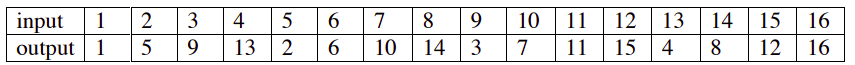
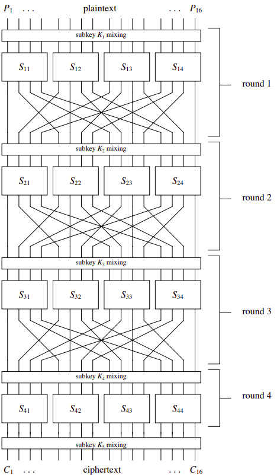
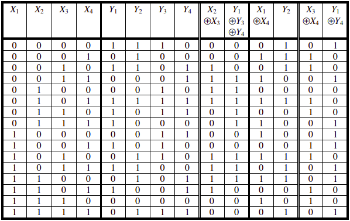
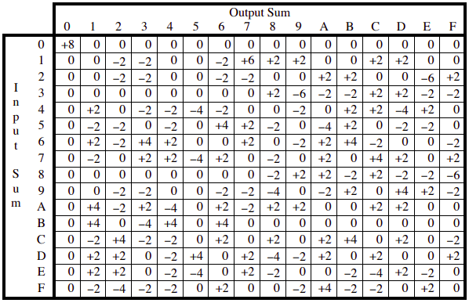
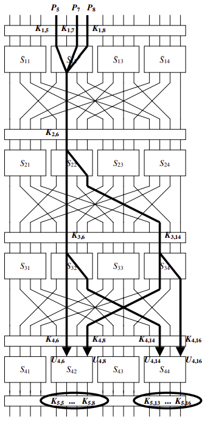
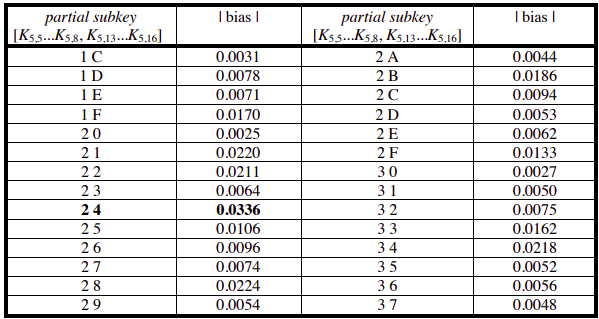

## 2 Cifrario di Base a Rete di Sostituzione-Permutazione

Il cifrario che verrà utilizzato per presentare i concetti è il Substitution-Permutation Network (SPN). Il cifrario prende un blocco di input a 16 bit e lo elabora ripetendo le operazioni fondamentali di un round per quattro volte. Ogni round consiste in:

1. **Sostituzione**
2. **Permutazione**
3. **Key Mixing**

Queste operazioni di base sono simili a quelle utilizzate nei cifrari moderni.

### 2.1 Sostituzioni

Nel nostro cifrario, suddividiamo il blocco di dati a 16 bit in quattro sotto-blocchi da 4 bit ciascuno. Ogni sotto-blocco viene elaborato da una S-box 4×4 (una sostituzione con 4 bit di input e 4 bit di output), che può essere facilmente implementata con una tabella di lookup di sedici valori a 4 bit, indicizzati dall'intero rappresentato dai 4 bit di input.

La proprietà fondamentale di una S-box è che è una **mappatura non lineare**, ovvero i bit di output non possono essere rappresentati come un'operazione lineare sui bit di input.

- Se un sistema è **lineare**, il suo output può essere espresso come una combinazione lineare (ad esempio, XOR, addizione modulo 2, moltiplicazione di matrici) dei bit di input.
- Se è **non lineare**, non esiste una relazione lineare semplice di questo tipo.

**1. Esempio di mappatura lineare**

Supponiamo di avere una funzione lineare che trasforma 3 bit di input in 3 bit di output, definita come:

$$
\begin{cases} 
y_0 = x_0 \oplus x_1 \\
y_1 = x_1 \oplus x_2 \\ 
y_2 = x_0 \oplus x_2 
\end{cases}
$$

Dove $\oplus$ è l'operazione XOR (addizione modulo 2).

  **Input:** $$(x_0, x_1, x_2) = (1, 0, 1)$$ 
  **Output:**  
  $$\begin{align*}
  y_0 &= 1 \oplus 0 = 1 \\
  y_1 &= 0 \oplus 1 = 1 \\
  y_2 &= 1 \oplus 1 = 0
  \end{align*}
  Risultato: $(1, 1, 0)$$.

Questa è una mappatura lineare perché ogni bit di output è una combinazione lineare (XOR) dei bit di input.

**2. Esempio di S-box non lineare**

Una S-box è progettata per rompere la linearità. Consideriamo una semplice S-box a 3 bit (esempio semplificato, non usato in pratica):

$$
\begin{array}{|c|c|}
\hline
\text{Input (x)} & \text{Output (S[x])} \\
\hline
000 & 110 \\
001 & 101 \\
010 & 011 \\
011 & 000 \\
100 & 111 \\
101 & 100 \\
110 & 010 \\
111 & 001 \\
\hline
\end{array}
$$

  **Input:** $(1, 0, 1)$ (5 in decimale)  
  **Output:** Cercando nella tabella, $S[5] = 100$.

**Perché è non lineare?**
Proviamo a verificare se esiste una combinazione lineare che descrive tutti gli output. Consideriamo la generica forma lineare:

$$
\begin{cases}
y_0 = a_0x_0 \oplus b_0x_1 \oplus c_0x_2 \\
y_1 = a_1x_0 \oplus b_1x_1 \oplus c_1x_2 \\
y_2 = a_2x_0 \oplus b_2x_1 \oplus c_2x_2
\end{cases}
$$

Analizzando il caso input $000 \rightarrow 110$:
$$
\begin{cases}
1 = 0 \oplus 0 \oplus 0 \\
1 = 0 \oplus 0 \oplus 0 \\
0 = 0 \oplus 0 \oplus 0
\end{cases}
$$
Otteniamo $1=0$, che è una contraddizione. Quindi la S-box è necessariamente non lineare.

I sistemi lineari sono deboli in crittografia perché possono essere facilmente invertiti o violati utilizzando tecniche come l'eliminazione di Gauss o la crittanalisi lineare. La non linearità introduce complessità, rendendo le funzioni più difficili da analizzare e invertire, il che è essenziale per una cifratura sicura.

Per il nostro cifrario, utilizzeremo la stessa mappatura non lineare per tutte le S-box. Gli attacchi di crittanalisi lineare e differenziale si applicano allo stesso modo sia che ci sia una sola mappatura sia che tutte le S-box abbiano mappature diverse.

### 2.2 Permutazione

La parte di permutazione di un round consiste semplicemente nella trasposizione dei bit o nella permutazione delle loro posizioni. L'output $i$ della S-box $j$ viene collegato all'input $j$ della S-box $i$. Si noti che una permutazione nell'ultimo round non avrebbe alcuno scopo e, pertanto, il nostro cifrario non la prevede.

### 2.3 Key Mixing

Per ottenere il mixing con la chiave, utilizziamo un semplice XOR bit-a-bit tra i bit della chiave associati a un round (chiamati sottochiave) e il blocco di dati in input a un round. Inoltre, una sottochiave viene applicata anche dopo l'ultimo round, assicurando che l'ultimo strato di sostituzione non possa essere facilmente ignorato da chi lavora all'indietro attraverso la sostituzione dell'ultimo round. Normalmente, in un cifrario, la sottochiave per un round è derivata dalla chiave principale attraverso un processo noto come schedulazione della chiave. Nel nostro cifrario, assumeremo che tutti i bit delle sottochiavi siano generati in modo indipendente e non correlati.

### 2.4 Decifratura

Per decifrare, i dati vengono essenzialmente elaborati all'indietro attraverso il network. Tuttavia, le mappature utilizzate nelle S-box della rete di decifratura sono l'inverso delle mappature nella rete di cifratura (ovvero, l'input diventa output e l'output diventa input). Ciò implica che, affinché una SPN permetta la decifratura, tutte le S-box devono essere biiettive, cioè una mappatura uno-a-uno con lo stesso numero di bit di input e output. Inoltre, affinché la rete decifri correttamente, le sottochiavi vengono applicate in ordine inverso e i bit delle sottochiavi devono essere riorganizzati secondo la permutazione. Si noti inoltre che l'assenza della permutazione dopo l'ultimo round garantisce che la rete di decifratura possa avere la stessa struttura della rete di cifratura. (Se ci fosse una permutazione dopo l'ultimo strato di sostituzione nella cifratura, la decifratura richiederebbe una permutazione prima del primo strato di sostituzione.)

## 3. Crittanalisi Lineare  

### 3.1 Panoramica dell’Attacco

La crittanalisi lineare cerca di sfruttare le occorrenze ad alta probabilità di espressioni lineari che coinvolgono bit del testo in chiaro, bit del "testo cifrato" (in realtà utilizzeremo bit provenienti dall’output del penultimo round) e bit delle sottochiavi. Si tratta di un attacco a testo in chiaro noto (*known plaintext attack*), ovvero si basa sull’ipotesi che l’attaccante disponga di un insieme di testi in chiaro e dei corrispondenti testi cifrati. Tuttavia, l’attaccante non può scegliere quali testi in chiaro (e relativi testi cifrati) siano disponibili. In molte applicazioni e scenari, è ragionevole assumere che l’attaccante abbia accesso a un insieme casuale di coppie (testo in chiaro, testo cifrato).  

L’idea di base è approssimare il funzionamento di una parte del cifrario con un’espressione lineare, dove la linearità si riferisce a un’operazione bit-a-bit modulo 2 (ovvero lo XOR, indicato con "$\oplus$"). Tale espressione ha la forma:  

$$\begin{equation*}
X_{i_1} \oplus X_{i_2} \oplus \dots \oplus X_{i_u} \oplus Y_{j_1} \oplus Y_{j_2} \oplus \dots \oplus Y_{j_v} = 0
\end{equation*}$$

dove $X_i$ rappresenta l’$i$-esimo bit dell’input $X = [X_1, X_2, \ldots]$ e $Y_j$ rappresenta il $j$-esimo bit dell’output $Y = [Y_1, Y_2, \ldots]$. Questa equazione rappresenta la somma XOR di $u$ bit di input e $v$ bit di output.  

L’approccio della crittanalisi lineare consiste nell’individuare espressioni di questo tipo che abbiano una probabilità di verificarsi significativamente alta o bassa. (Se un’espressione lineare come quella sopra fosse sempre vera o falsa per ogni input e output, il cifrario sarebbe banale da violare.) Se un cifrario mostra una tendenza per cui l’equazione vale con alta probabilità (o non vale con alta probabilità), ciò è indice di una scarsa capacità di randomizzazione del cifrario.

Considera che se selezionassimo valori casuali per u + v bit e li inserissimo nell'equazione precedente, la probabilità che l'espressione sia valida sarebbe esattamente 1/2. È la deviazione o **bias** dalla probabilità di 1/2 che un'espressione sia valida a essere sfruttata nella crittanalisi lineare:  
più un'espressione lineare si discosta dall'avere una probabilità di 1/2, migliore sarà l'applicabilità della crittanalisi lineare. Nel resto del documento, ci riferiamo alla quantità di cui la probabilità di un'espressione lineare devia da 1/2 come **bias della probabilità lineare**.  

Pertanto, se l'espressione precedente è valida con probabilità $ p_L $ per casuali testi in chiaro e corrispondenti testi cifrati, allora il bias di probabilità è $ p_L - \frac{1}{2} $.  
Maggiore è l'entità del bias di probabilità, $ |p_L - \frac{1}{2}| $, migliore sarà l'applicabilità della crittanalisi lineare, con un minor numero di testi in chiaro noti richiesti per l'attacco.  

Analizziamo la costruzione di un'approssimazione lineare che coinvolge:
- i bit del testo in chiaro (rappresentati da X nell'equazione (1))
- l'input all'ultimo round del cifrario (o equivalentemente l'output del penultimo round), rappresentato da Y nell'equazione (1). 

I bit del testo in chiaro sono casuali e di conseguenza lo sono anche i bit di input dell'ultimo round.

L'equazione (1) potrebbe essere riformulata equivalentemente per avere al secondo membro la somma di alcuni bit della sottochiave. Tuttavia, nella forma attuale con "0" a destra, l'equazione coinvolge implicitamente bit della sottochiave: questi bit sono fissi ma ignoti (essendo determinati dalla chiave sotto attacco) e sono implicitamente assorbiti nello "0" al secondo membro dell'equazione (1) e nella probabilità $p_L$ che l'espressione lineare sia valida.

Se la somma dei bit di sottochiave coinvolti vale "0", il bias dell'equazione (1) avrà lo stesso segno (+ o -) del bias dell'espressione contenente la somma delle sottochiavi. Se invece la somma dei bit di sottochiave coinvolti vale "1", il bias dell'equazione (1) avrà segno opposto.
L'equazione 1 in questo caso sta a indicare lo xor dei bit del testo in chiaro con lo xor dei bit del testo cifrato = 0.

Si noti che $p_L = 1$ implica che l'espressione lineare (1) rappresenta perfettamente il comportamento del cifrario e che il cifrario presenta una vulnerabilità catastrofica. Se $p_L = 0$, allora (1) rappresenta una relazione affine nel cifrario, anch'essa indicativa di una vulnerabilità catastrofica. Per sistemi a somma mod-2, una funzione affine è semplicemente il complemento di una funzione lineare. Sia le approssimazioni lineari che quelle affini, indicate rispettivamente da $p_L > 1/2$ e $p_L < 1/2$, sono ugualmente suscettibili alla crittanalisi lineare, e useremo generalmente il termine "lineare" per riferirci sia a relazioni lineari che affini.

Si costruiscono espressioni altamente lineari e quindi sfruttabili considerando le proprietà dell'unico componente non lineare del cifrario: la S-box. Quando si enumerano le proprietà di non linearità della S-box, è possibile sviluppare approssimazioni lineari tra insiemi di bit di input e output della S-box. Di conseguenza, è possibile concatenare le approssimazioni lineari delle S-box in modo che i bit intermedi (cioè i bit di dati interni al cifrario) possano essere cancellati, ottenendo un'espressione lineare con un bias elevato che coinvolge solo bit del testo in chiaro e bit di input dell'ultimo round.

**Esempio teorico**
In crittografia, un'approssimazione lineare è un'equazione del tipo:  
$$
\bigoplus_{i \in A} P_i \oplus \bigoplus_{j \in B} C_j = \bigoplus_{k \in K} K_k \quad \text{(1)}
$$  
Dove:  
- $ P_i $: bit del testo in chiaro (*plaintext*),  
- $ C_j $: bit del testo cifrato (*ciphertext*),  
- $ K_k $: bit della sottochiave (*key bits*),  

L'equazione (1) **non è esatta**, ma ha una **probabilità $ p \neq 0.5 $** di essere vera. Questo "bias" ($ |p - 0.5| $) è sfruttato per attaccare il cifrario.

L'equazione (1) può essere riscritta in due modi equivalenti:  
1. **Forma implicita** (con "0" a destra):  
   $$
   \bigoplus_{i \in A} P_i \oplus \bigoplus_{j \in B} C_j = 0 \quad \text{(1a)}
   $$  
   Qui i bit della sottochiave $ \bigoplus_{k \in K} K_k $ sono "assorbiti" nello "0":  
   - Se $ \bigoplus_{k \in K} K_k = 0 $, l'equazione (1a) è vera con probabilità $ p $.  
   - Se $ \bigoplus_{k \in K} K_k = 1 $, l'equazione (1a) è vera con probabilità $ 1 - p $ (il bias cambia segno).  

2. **Forma esplicita** (con i bit di sottochiave):  
   $$
   \bigoplus_{i \in A} P_i \oplus \bigoplus_{j \in B} C_j = \bigoplus_{k \in K} K_k \quad \text{(1b)}
   $$  

Nella crittanalisi lineare:  
1. **Fase 1**: Troviamo un'approssimazione lineare (1a) con bias significativo ($ p \neq 0.5 $), **ignorando inizialmente la sottochiave**.  
2. **Fase 2**: Usiamo (1a) per **indovinare** $ \bigoplus_{k \in K} K_k $:  
   - Se (1a) è vera più spesso del 50%, assumiamo $ \bigoplus_{k \in K} K_k = 0 $.  
   - Se è vera meno del 50%, assumiamo $ \bigoplus_{k \in K} K_k = 1 $.  

**Esempio pratico**
Supponiamo di avere:  
$$
P_0 \oplus P_1 \oplus C_0 = 0 \quad \text{(bias } p = 0.7\text{)}
$$  
- **Se $ K_0 \oplus K_1 = 0 $**: L'equazione è vera con probabilità $ 0.7 $.  
- **Se $ K_0 \oplus K_1 = 1 $**: L'equazione è vera con probabilità $ 0.3 $ (cioè $ 1 - 0.7 $).  

**Attacco:**  
1. Raccolta di $ N $ coppie (plaintext, ciphertext).  
2. Contiamo quante volte $ P_0 \oplus P_1 \oplus C_0 = 0 $.  
   - Se è vero il 70% delle volte → $ K_0 \oplus K_1 = 0 $.  
   - Se è vero il 30% delle volte → $ K_0 \oplus K_1 = 1 $.  

**Scenario semplificato**
- **Cifrario**: Un mini-cifrario a blocchi con:  
  - **Testo in chiaro (P)**: 2 bit ($ P_0, P_1 $).  
  - **Testo cifrato (C)**: 2 bit ($ C_0, C_1 $).  
  - **Sottochiave (K)**: 2 bit ($ K_0, K_1 $) (ignoti all'attaccante).  

- **Approssimazione lineare trovata** (con bias $ p = 0.75 $):  
  $$
  P_0 \oplus P_1 \oplus C_0 = K_0 \oplus K_1 \quad \text{(1)}
  $$  
  - Se $ K_0 \oplus K_1 = 0 $, l'equazione $ P_0 \oplus P_1 \oplus C_0 = 0 $ è vera con probabilità $ 0.75 $.  
  - Se $ K_0 \oplus K_1 = 1 $, l'equazione è vera con probabilità $ 0.25 $ (cioè $ 1 - 0.75 $).  

**Fase 1: Raccolta dati**
Supponiamo di avere 8 coppie (plaintext, ciphertext), alcune delle quali cifrate con la stessa sottochiave $ K_0, K_1 $:  

| **Plaintext (P)** | **Ciphertext (C)** | $ P_0 \oplus P_1 \oplus C_0 $ |
|-------------------|--------------------|----------------------------------|
| 00                | 10                 | $ 0 \oplus 0 \oplus 1 = 1 $    |
| 01                | 00                 | $ 0 \oplus 1 \oplus 0 = 1 $    |
| 10                | 11                 | $ 1 \oplus 0 \oplus 1 = 0 $    |
| 11                | 01                 | $ 1 \oplus 1 \oplus 0 = 0 $    |
| 00                | 11                 | $ 0 \oplus 0 \oplus 1 = 1 $    |
| 01                | 10                 | $ 0 \oplus 1 \oplus 1 = 0 $    |
| 10                | 00                 | $ 1 \oplus 0 \oplus 0 = 1 $    |
| 11                | 11                 | $ 1 \oplus 1 \oplus 1 = 1 $    |

---

**Fase 2: Calcolo delle frequenze**
Contiamo quante volte $ P_0 \oplus P_1 \oplus C_0 = 0 $:  
- **Risultati**: `[1, 1, 0, 0, 1, 0, 1, 1]`  
- **Numero di "0"**: 3 su 8 (frequenza osservata = $ 3/8 = 0.375 $).  

**Fase 3: Deduzione dei bit di sottochiave**
- **Se $ K_0 \oplus K_1 = 0 $**:  
  L'equazione dovrebbe essere vera con probabilità $ 0.75 $, ma osserviamo $ 0.375 $ (vicino a $ 0.25 $).  
- **Se $ K_0 \oplus K_1 = 1 $**:  
  L'equazione dovrebbe essere vera con probabilità $ 0.25 $, e osserviamo $ 0.375 $ (più vicino a $ 0.25 $ che a $ 0.75 $).  

**Conclusione**:  
Poiché la frequenza osservata ($ 0.375 $) è più vicina a $ 0.25 $ che a $ 0.75 $, deduciamo che:  
$$
K_0 \oplus K_1 = 1
$$  

**Fase 4: Ricostruzione della chiave**
Supponiamo di sapere (da altre approssimazioni) che:  
- $ K_0 = 1 $.  
Allora:  
$$
K_1 = K_0 \oplus (K_0 \oplus K_1) = 1 \oplus 1 = 0
$$  
**Sottochiave recuperata**: $ K_0 = 1 $, $ K_1 = 0 $.

**Cosa succede con bias più deboli**  
Se avremmo avuto $ p = 0.51 $ (bias $ 0.01 $):  
- Servirebbero $ \approx \frac{1}{(0.01)^2} = 10{,}000 $ coppie per distinguere il segnale dal rumore.  
**Esempio con bias diverso**  
Se avessi usato $ p = 0.625 $ (bias $ 0.125 $):  
- Per $ K_0 \oplus K_1 = 0 $: l'equazione è vera il 62.5% delle volte.  
- Per $ K_0 \oplus K_1 = 1 $: è vera il 37.5% delle volte.  
- Servirebbero $ \approx \frac{1}{(0.125)^2} = 64 $ coppie per vedere l'effetto. 

### 3.2 Piling-Up Principle

Consideriamo due variabili binarie casuali, X₁ e X₂. Iniziamo osservando le semplici relazioni: 
- $X_1\oplus X_2 = 0$ è un'espressione lineare ed equivale a X₁ = X₂
- $X_1\oplus X_2 = 1$ è un'espressione affine ed equivale a X₁ ≠ X₂

Supponiamo ora che le distribuzioni di probabilità siano date da:

$$
\text{Pr}(X_1 = i) = 
\begin{cases} 
p_1 & \text{se } i = 0 \\
1-p_1 & \text{se } i = 1 
\end{cases}
$$
e
$$
\text{Pr}(X_2 = i) = 
\begin{cases} 
p_2 & \text{se } i = 0 \\
1-p_2 & \text{se } i = 1 
\end{cases}
$$

Se le due variabili sono indipendenti, allora:

$$
\text{Pr}(X_1 = i, X_2 = j) = 
\begin{cases} 
p_1p_2 & \text{se } i=0, j=0 \\
p_1(1-p_2) & \text{se } i=0, j=1 \\
(1-p_1)p_2 & \text{se } i=1, j=0 \\
(1-p_1)(1-p_2) & \text{se } i=1, j=1 
\end{cases}
$$

Si può dimostrare che:
$$
\begin{aligned}
\text{Pr}(X_1 \oplus X_2 = 0) &= \text{Pr}(X_1 = X_2) \\ 
&\quad= \text{Pr}(X_1=0, X_2=0) + \text{Pr}(X_1=1, X_2=1) \\
&\quad= p_1p_2 + (1-p_1)(1-p_2)
\end{aligned}
$$

Un approccio alternativo consiste nell'esprimere:
$$
p_1 = \frac{1}{2} + \epsilon_1 \quad \text{e} \quad p_2 = \frac{1}{2} + \epsilon_2
$$
dove ε₁ e ε₂ rappresentano i bias di probabilità, con -1/2 ≤ ε₁,ε₂ ≤ +1/2. Ne consegue che:

$$
\text{Pr}(X_1 \oplus X_2 = 0) = \frac{1}{2} + 2\epsilon_1\epsilon_2
$$

e il bias $\epsilon_{1,2}$ di $X_1 \oplus X_2 = 0$ è:

$$
\epsilon_{1,2} = 2\epsilon_1\epsilon_2.
$$

Questo risultato può essere esteso a più di due variabili binarie casuali, $X_1$ fino a $X_n$, con probabilità $p_1 = \frac{1}{2}+\epsilon_1$ fino a $p_n = \frac{1}{2}+\epsilon_n$. La probabilità che $X_1 \oplus \cdots \oplus X_n = 0$ valga può essere determinata dal Piling-Up Lemma, che assume che tutte le $n$ variabili binarie casuali siano indipendenti.

**Lemma di Piling-Up (Matsui)**  
Per $n$ variabili binarie indipendenti e casuali $X_1, X_2, \ldots, X_n$:

$$
\text{Pr}(X_1 \oplus \cdots \oplus X_n = 0) = \frac{1}{2} + 2^{n-1}\prod_{i=1}^n \epsilon_i
$$

o equivalentemente:

$$
\epsilon_{1,2,\ldots,n} = 2^{n-1}\prod_{i=1}^n \epsilon_i
$$

dove $\epsilon_{1,2,\ldots,n}$ rappresenta il bias di $X_1 \oplus \cdots \oplus X_n = 0$.

- Se $p_i = 0$ o $1$ per ogni $i$, allora $\text{Pr}(X_1 \oplus \cdots \oplus X_n = 0) = 0$ o $1$. 
- Se solo un $p_i = \frac{1}{2}$, allora $\text{Pr}(X_1 \oplus \cdots \oplus X_n = 0) = \frac{1}{2}$.

Nello sviluppo dell'approssimazione lineare di un cifrario, i valori $X_i$ rappresenteranno in realtà approssimazioni lineari delle S-box. 
 
Consideriamo quattro variabili binarie indipendenti $X_1, X_2, X_3$ e $X_4$. Sia:

$$
\text{Pr}(X_1 \oplus X_2 = 0) = \frac{1}{2} + \epsilon_{1,2}
$$

e

$$
\text{Pr}(X_2 \oplus X_3 = 0) = \frac{1}{2} + \epsilon_{2,3}
$$

Consideriamo la somma $X_1 \oplus X_3$ ottenuta aggiungendo $X_1 \oplus X_2$ e $X_2 \oplus X_3$:

$$
\text{Pr}(X_1 \oplus X_3 = 0) = \text{Pr}\bigl([X_1 \oplus X_2] \oplus [X_2 \oplus X_3] = 0\bigr)
$$

Stiamo quindi combinando espressioni lineari per formare una nuova espressione lineare. Poiché possiamo considerare le variabili casuali $X_1 \oplus X_2$ e $X_2 \oplus X_3$ come indipendenti, possiamo usare il Lemma di Piling-Up per determinare:

$$
\text{Pr}(X_1 \oplus X_3 = 0) = \frac{1}{2} + 2\epsilon_{1,2}\epsilon_{2,3}
$$

e di conseguenza:

$$
\epsilon_{1,3} = 2\epsilon_{1,2}\epsilon_{2,3}
$$

Come vedremo:
- Le espressioni $X_1 \oplus X_2 = 0$ e $X_2 \oplus X_3 = 0$ sono analoghe alle approssimazioni lineari delle S-box
- $X_1 \oplus X_3 = 0$ è analoga a un'approssimazione del cifrario dove il bit intermedio $X_2$ viene eliminato

Naturalmente, l'analisi reale sarà più complessa e coinvolgerà molte approssimazioni di S-box.

### 3.3 Analizzando i componenti del cifrario

Vediamo delel vulnerabilità lineari delle S-box. Consideriamo la rappresentazione della S-box, con input $X = [X_1 X_2 X_3 X_4]$ e output corrispondente $Y = [Y_1 Y_2 Y_3 Y_4]$.

Tutte le approssimazioni lineari possono essere esaminate per valutarne l'utilità calcolando il bias di probabilità per ciascuna. In particolare, esaminiamo tutte le espressioni nella forma dell'equazione (1), dove $X$ e $Y$ rappresentano rispettivamente l'input e l'output della S-box.

Ad esempio, per la S-box utilizzata nel nostro cifrario, consideriamo l'espressione lineare:
$$
X_2 \oplus X_3 \oplus Y_1 \oplus Y_3 \oplus Y_4 = 0
$$
o equivalentemente:
$$
X_2 \oplus X_3 = Y_1 \oplus Y_3 \oplus Y_4
$$

Analizzando tutti i 16 possibili valori di input $ X $ e i corrispondenti output $ Y $, si osserva che l'espressione precedente risulta vera in esattamente 12 casi su 16. Pertanto, il bias di probabilità risulta: $\frac{12}{16} - \frac{1}{2} = \frac{1}{4}$

Analogamente, per l'equazione:

$$
X_1 \oplus X_4 = Y_2
$$

si osserva un bias di probabilità pari a 0, mentre per l'equazione:

$$
X_3 \oplus X_4 = Y_1 \oplus Y_4
$$

il bias di probabilità risulta: $\frac{2}{16} - \frac{1}{2} = -\frac{3}{8}$ Nell'ultimo caso, la migliore approssimazione risulta essere di tipo affine (come indicato dal segno negativo). Tuttavia, il successo dell'attacco dipende esclusivamente dal valore assoluto del bias. Come dimostreremo, le approssimazioni affini possono essere utilizzate con la stessa efficacia delle approssimazioni lineari.

Una enumerazione completa di tutte le approssimazioni lineari della S-box nel nostro cifrario è fornita nella tabella sottostante (tabella delle approssimazioni lineari). Ogni elemento nella tabella rappresenta il numero di corrispondenze tra:
- Equazione lineare in input (rappresentata in esadecimale come "Input Sum")
- Somma dei bit di output (rappresentata in esadecimale come "Output Sum")

Il tutto meno 8.

Il bias di probabilità per un particolare combinazione lineare di input e output si ottiene dividendo il valore dell'elemento per 16.

Il valore esadecimale che rappresenta una somma, quando interpretato come valore binario, indica le variabili coinvolte nella somma. Per una combinazione lineare di variabili di input rappresentata come:

$$ a_1 \land X_1 \oplus a_2 \land X_2 \oplus a_3 \land X_3 \oplus a_4 \land X_4 $$

dove:
$a_i \in \{0,1\}$, $\land$ è l'AND e il valore esadecimale rappresenta il valore binario $a_1a_2a_3a_4$, dove $a_1$ è il bit più significativo.

Analogamente, per una combinazione lineare di bit di output:

$$ b_1 \land Y_1 \oplus b_2 \land Y_2 \oplus b_3 \land Y_3 \oplus b_4 \land Y_4 $$

dove $b_i \in \{0,1\}$, il valore esadecimale rappresenta il vettore binario $b_1b_2b_3b_4$.

Il bias dell'equazione lineare: 
$$ X_3 \oplus X_4 = Y_1 \oplus Y_4$$
- Input esadecimale: $3$ ($0011$)
- Output esadecimale: $9$ ($1001$)

Risultati:
- Bias: $-\frac{6}{16} = -\frac{3}{8}$
- Probabilità che l'equazione sia vera: $\frac{1}{2} + \left(-\frac{3}{8}\right) = \frac{1}{8}$

Alcune proprietà fondamentali della tabella delle approssimazioni lineari possono essere osservate:

1. **Combinazioni senza input**:
   - La probabilità che una somma di un sottoinsieme non vuoto di bit di output sia uguale a una somma che non coinvolge bit di input è esattamente $\frac{1}{2}$.
   - Motivo: Per una S-box biiettiva, qualsiasi combinazione lineare di bit di output deve avere un numero uguale di zeri e uni.

2. **Caso speciale (angolo in alto a sinistra)**:
   - La combinazione lineare che non coinvolge bit di output equivale sempre alla combinazione lineare senza bit di input.
   - Risultato:
     - Bias: $+\frac{1}{2}$
     - Valore nella tabella: $+8$ (posizione top-left)

3. **Struttura della tabella**:
   - La prima riga contiene tutti zeri, eccetto il valore più a sinistra (che è +8).
   - La prima colonna contiene tutti zeri, eccetto il valore in alto (sempre +8).

4. **Proprietà di somma**:
   - La somma di qualsiasi riga o colonna deve essere $+8$ o $-8$.

### 3.4 Costruire le Approssimazioni Lineari per il Cifrario Completo

#### Approccio alla Crittanalisi Lineare di una SPN

Una volta compilate le informazioni di approssimazione lineare per le S-box in una SPN, abbiamo i dati necessari per determinare le approssimazioni lineari del cifrario completo nella forma dell'equazione (1). Ciò può essere ottenuto concatenando appropriate approssimazione lineari delle S-box. Costruendo un'approssimazione lineare che coinvolga i bit del plaintext e i bit dell'ouput delle S-box del penultimo round. In questo modo è possibile attaccare il cifrario recuperando un sottoinsieme dei bit della subkey utilizzata all'ultimo round.

#### Esempio Pratico
Consideriamo un'approssimazione che coinvolge:

S₁₂, S₂₂, S₃₂, S₃₄ 

Notiamo come Copre solo i primi 3 round (non tutti e 4), ciò è utile per derivare i bit della subkey finale. Usiamo le seguenti approssimazione delle S-box:

#### Approssimazioni Specifiche:
| S-box | Approssimazione                     | Probabilità | Bias  |
|-------|-------------------------------------|-------------|-------|
| S₁₂   | $X_1 \oplus X_3 \oplus X_4 = Y_2$   | 12/16       | +1/4  |
| S₂₂   | $X_2 = Y_2 \oplus Y_4$              | 4/16        | -1/4  |
| S₃₂   | $X_2 = Y_2 \oplus Y_4$              | 4/16        | -1/4  |
| S₃₄   | $X_2 = Y_2 \oplus Y_4$              | 4/16        | -1/4  |

#### Notazione Tecnica
- **$U_i$ ($V_i$)**: Blocco di 16 bit all'input (output) delle S-box del round _i_
- **$U_{i,j}$ ($V_{i,j}$)**: j-esimo bit del blocco $U_i$ ($V_i$)
- **$K_i$**: Blocco di bit della subkey (XOR all'input del round _i_). Eccezione: $K_5$ è la chiave XOR all'output del round 4

Pertanto, possiamo esprimere:

$$ U_1 = P \oplus K_1 $$

dove $P$ rappresenta il blocco di 16 bit del plaintext.

Utilizzando l'approssimazione lineare del 1° round, otteniamo:

$$ V_{1,6} = U_{1,5} \oplus U_{1,7} \oplus U_{1,8}
 = (P_5 \oplus K_{1,5}) \oplus (P_7 \oplus K_{1,7}) \oplus (P_8 \oplus K_{1,8}) \quad \text{(2)}$$

con probabilità $\frac{3}{4}$.

Per l'approssimazione nel 2° round, abbiamo:

$$ V_{2,6} \oplus V_{2,8} = U_{2,6} $$

con probabilità $\frac{1}{4}$. Poiché $U_{2,6} = V_{1,6} \oplus K_{2,6}$, possiamo derivare un'approssimazione della forma:

$$ V_{2,6} \oplus V_{2,8} = V_{1,6} \oplus K_{2,6} $$

con probabilità $\frac{1}{4}$ e combinandola con l'equazione (2) (probabilità $\frac{3}{4}$) abbiamo che:
   
$$V_{2,6} \oplus V_{2,8} \oplus P_5 \oplus P_7 \oplus P_8 \oplus K_{1,5} \oplus K_{1,7} \oplus K_{1,8} \oplus K_{2,6} = 0 \quad \text{(3)}$$
     
con probabilità: $\frac{1}{2} + 2\left(\frac{3}{4}-\frac{1}{2}\right)\left(\frac{1}{4}-\frac{1}{2}\right) = \frac{3}{8}$ con un bias di: $-\frac{1}{8}$ data dal Pilinig-Up Lemma.

Nota: Si assume l'indipendenza delle approssimazioni delle S-box, ipotesi non rigorosamente corretta ma efficace in pratica in quanto funziona bene nella maggior parte dei cifrari.

Per l'approssimazione nel 3° round, abbiamo:

   $$V_{3,6} \oplus V_{3,8} = U_{3,6}$$ 
   
con probabilità: $\frac{1}{4}$
   $$V_{3,14} \oplus V_{3,16} = U_{3,14}$$ 
con probabilità: $\frac{1}{4}$. Poiché:
     $U_{3,6} = V_{2,6} \oplus K_{3,6}$ e 
     $U_{3,14} = V_{2,8} \oplus K_{3,14}$ Otteniamo che:
     $$V_{3,6} \oplus V_{3,8} \oplus V_{3,14} \oplus V_{3,16} \oplus V_{2,6} \oplus K_{3,6} \oplus V_{2,8} \oplus K_{3,14} = 0 \quad \text{(4)}$$
con probabilità: $\frac{1}{2} + 2\left(\frac{1}{4}-\frac{1}{2}\right)^2 = \frac{5}{8}$ e bias di: $+\frac{1}{8}$ (applicato il Piling-Up Lemma).

Ora combinando (3) e (4):
     $$V_{3,6} \oplus V_{3,8} \oplus V_{3,14} \oplus V_{3,16} \oplus P_5 \oplus P_7 \oplus P_8 \oplus K_{1,5} \oplus K_{1,7} \oplus K_{1,8} \oplus K_{2,6} \oplus K_{3,6} \oplus K_{3,14} = 0$$

Sostituendo:
     $$U_{4,6} = V_{3,6} \oplus K_{4,6}$$
     $$U_{4,8} = V_{3,14} \oplus K_{4,8}$$
     $$U_{4,14} = V_{3,8} \oplus K_{4,14}$$
     $$U_{4,16} = V_{3,16} \oplus K_{4,16}$$

Formulazione finale:
     $$U_{4,6} \oplus U_{4,8} \oplus U_{4,14} \oplus U_{4,16} \oplus P_5 \oplus P_7 \oplus P_8 \oplus \sum K = 0$$
     dove:
     $$\sum K = K_{1,5} \oplus K_{1,7} \oplus K_{1,8} \oplus K_{2,6} \oplus K_{3,6} \oplus K_{3,14} \oplus K_{4,6} \oplus K_{4,8} \oplus K_{4,14} \oplus K_{4,16}$$
con probabilità: $\frac{1}{2} + 2^3\left(\frac{3}{4}-\frac{1}{2}\right)\left(\frac{1}{4}-\frac{1}{2}\right)^3 = \frac{15}{32}$ 
(e bias: $-\frac{1}{32}$)

La sommatoria è fissata a 0 o a 1 in base alla chiave del cifrario, poiché fissata notiamo che:

$$
U_{4,6} \oplus U_{4,8} \oplus U_{4,14} \oplus U_{4,16} \oplus P_5 \oplus P_7 \oplus P_8 = 0 \quad \text{(5)}$$

presenta due possibili scenari probabilistici:

- Probabilità $\frac{15}{32}$ se la sommatoria è = 0
- Probabilità ($1 - \frac{15}{32}$) $= \frac{17}{32}$  se la sommatoria è = 1.

Abbiamo quindi un'approssimazione lineare dei primi tre roudn con un bias di magnitudo: $\frac{1}{32}$.

### 3.5 Trovare i Bit della chiave

Una volta scoperta un'approssimazione lineare per $R-1$ round di un cifrario a $R$ round con un bias di probabilità sufficientemente grande, è possibile attaccare il cifrario recuperando i bit della subkey finale. Nel caso del nostro cifrario esempio, possiamo estrarre bit dalla subkey $K_5$ utilizzando un'approssimazione lineare di 3 round. Chiameremo **target partial subkey** i bit da recuperare della subkey finale. Nello specifico, questi bit sono quelli della subkey finale associati alle S-box nell'ultimo round influenzate dai bit di dati coinvolti nell'approssimazione lineare.

#### Processo di Attacco
Il processo di attacco include una decodifica parziale dell'ultimo round del cifrario:
Per tutti i possibili valori della target partial subkey:

Si applica XOR tra i bit del ciphertext e i bit della target partial subkey e il risultato lo si esegue all'indietro attraverso  le corrispondenti S-box. Ciò è eseguito per ogni chipertext/plaintext e si mantiene un contatore per ogni valore della target partial subkey.

Il contatore viene incrementato quando l'espressione lineare risulta vera per:
- I bit di input alle S-box dell'ultimo round (determinati dalla decrittazione parziale).
- I bit di plaintext noti.

Il valore della target partial subkey con il conteggio che si discosta dalla metà dei campioni di chipertext/plaintext viene assunto come corretto. 

**Subkey corretta**: Ciò funziona perché si assume che il corretto valore della subkey parziale farà si che l'approssimazione lineare si valida con una probabilità significativamente diversa da $1/2$.

**Subkey errata**: Si presume che una sottochiave errata porti a un'ipotesi relativamente casuale dei bit che entrano negli S-box dell'ultimo round e, di conseguenza, l'espressione lineare sarà valida con una probabilità prossima a $1/2$.

#### Applicazione al Nostro Esempio
L'espressione lineare (5) coinvolge gli input delle S-box $S_{42}$ e $S_{44}$ nell'ultimo round. Per ogni campione plaintext/ciphertext:

1. Si testano tutti i 256 valori per la target partial subkey:
   $$ [K_{5,5}...K_{5,8}, K_{5,13}...K_{5,16}] $$

2. Per ogni valore della sottochiave parziale: Si incrementa il contatore quando (5) è vera dove si calcolano $[U_{4,5}...U_{4,8}, U_{4,13}...U_{4,16}]$ decrittando parzialmente attraverso $S_{42}$ e $S_{44}$
   
3. Il valore che diverge di più dalla metà dei campioni di chipertext/plaintext si assume sia il valore corretto:
   - Se $\sum K = 0$: probabilità $< 1/2$
   - Se $\sum K = 1$: probabilità $> 1/2$

#### ESEMPIO DI SIMULAZIONE (16)

Simulazione dell'attacco al cifrario esempio generando 10.000 coppie plaintext/ciphertext note e seguendo il processo descritto per i valori parziali di subkey:

- $[K_{5,5}...K_{5,8}] = [0010]$ (hex 2)
- $[K_{5,13}...K_{5,16}] = [0100]$ (hex 4)

Il conteggio che si discosta maggiormente da 5.000 corrisponde al valore target `[2,4]` esadecimale. Questo conferma il successo nel derivare i bit della subkey.

Il valore del bias determinato (0.0336) risulta estremamente vicino al valore teorico atteso di $1/32 = 0.03125$.

Le discrepanze osservate tra i risultati sperimentali e le previsioni teoriche possono essere attribuite a diversi fattori: 
- Le proprietà delle S-box.
- L'assunzione di indipendenza necessaria per l'applicazione del Piling-Up Lemma e l'influenza delle linear hulls. 

### 3.6 Complessità dell'attacco
#### Definizione di S-box Attive
Chiamiamo **S-box attive** quelle coinvolte nell'approssimazione lineare. Nell'esempio, le quattro S-box nei round 1-3 influenzate dalle linee evidenziate sono attive. La probabilità che un'espressione lineare sia valida è legata al **Bias delle probabilità lineari** nelle S-box attive e al **Numero di S-box attive**. In generale, maggiore è l'entità della distorsione nelle S-box, maggiore è l'entità della distorsione dell'espressione complessiva. Inoltre, minore è il numero di S-box attive, maggiore è l'entità della distorsione dell'espressione lineare complessiva.

Sia $\epsilon$ il bias da $1/2$ della probabilità dell'espressione lineare valida per il cifrario completo. Il numero di plaintext noti necessari per l' attacco è proporzionale a $\epsilon^{-2}$. È ragionevole approssimare $N_L$ (numero di plaintext conosciuti richiesti) a:
  
$$ N_L \approx \frac{1}{\epsilon^2}$$

In pratica, è generalmente ragionevole aspettarsi che sia richiesto un piccolo multiplo di ${\epsilon^2}$ testi in chiaro noti. Sebbene, in senso stretto, la complessità della crittoanalisi potrebbe essere caratterizzata sia in termini di tempo che di spazio, faremo riferimento solo ai dati necessari per sferrare l'attacco in quanto assumiamo che se siamo in grado di acquisire $N_L$ testi in chiaro, siamo anche in grado di elaborarli.

Poiché il bias è derivato usando il Piling-Up Lemma, dove ogni termine nel prodotto si riferisce a un'approssimazione di una S-box, è facile vedere che il bias dipende dal bias delle approssimazioni lineari delle S-box e dal numero di S-box attive coinvolte. Approcci generali per fornire sicurezza contro la crittoanalisi lineare si sono concentrati sull'ottimizzazione delle S-box (cioè, minimizzando la distorsione massima) e sulla ricerca di strutture per massimizzare il numero di S-box attive.

#### Realtà:

Bisogna tuttavia fare attenzione: il concetto di una "prova" di sicurezza alla crittoanalisi lineare si basa solitamente sulla non esistenza di approssimazioni lineari altamente probabili. Tuttavia, il calcolo della probabilità di tali approssimazioni lineari si fonda sull'assunzione che ogni approssimazione di S-box sia indipendente (in modo che si possa usare il Piling-Up Lemma) e sull'assunzione che uno scenario di approssimazione lineare (cioè, un particolare insieme di S-box attive) sia sufficiente a determinare la migliore espressione lineare tra i bit del plaintext e i bit di dati in input all'ultimo round. 

La realtà è che le approssimazioni delle S-box non sono indipendenti e ciò può avere un impatto significativo sul calcolo della probabilità. Inoltre, scenari di approssimazione lineare che coinvolgono gli stessi bit del plaintext e dell'input dell'ultimo round ma diversi insiemi di S-box attive possono combinarsi per dare una probabilità lineare superiore a quella prevista da un singolo insieme di S-box attive. Questo concetto è indicato come "linear hull". 
Un numero di scenari di approssimazione lineare possono avere bias molto piccoli e, presi singolarmente, sembrano implicare che una cifratura potrebbe essere immune a un attacco lineare. Tuttavia, quando questi scenari vengono combinati, l'espressione lineare risultante tra i bit del testo in chiaro e dell'ingresso dell'ultimo round potrebbe avere un bias molto elevato. Ciononostante, l'approccio usato in questo articolo tende a funzionare bene per molte cifrature perché l'assunzione di indipendenza è un'approssimazione ragionevole e quando uno scenario di approssimazione lineare di un particolare insieme di S-box attive ha un'alto bias, tende a dominare il "linear hull".

## 4. Crittoanalisi Differenziale
### 4.1 Panoramica dell'Attacco
####
### 4.2 Analizzarndo le Componenti del Cifrario
####
### 4.3 Costruire le Caratteristiche Differenziali
####
### 4.4 Trovare i Bit della chiave
####
### 4.5 Complessità dell'attacco
####

# Poseidon
Poseidon è una funzione hash progettata specificamente per essere efficiente nei **sistemi a conoscenza zero** (ZKP), come zk-SNARKs e zk-STARKs. La sua struttura è ottimizzata per operazioni in campi finiti grandi (es. $\mathbb{F}_p$), il che la rende resistente agli attacchi classici ma suscettibile a nuove tecniche di analisi.

### 1. Crittanalisi Lineare vs. Differenziale per Poseidon
#### **Crittanalisi Differenziale**:
  - **Più rilevante** per Poseidon perché:
    - Poseidon usa trasformazioni non-lineari (come cubi $x^3$ o $x^5$) che resistono bene alle approssimazioni lineari.
    - La struttura a "permutazione a sostituzione-permutazione (SPN)" è simile a quella di AES, che è più vulnerabile a differenze propagabili.
  - **Possibili attacchi**:
    - Studio di **tracce differenziali** nei round parziali.
    - Analisi della propagazione delle differenze nel campo $\mathbb{F}_p$ (dove le operazioni sono mod $p$).
  
#### **Crittanalisi Lineare**:
  - **Meno efficace** perché:
    - Le non-linearità forti (es. $x^3$) rendono difficile trovare relazioni lineari significative.
    - Le approssimazioni lineari in campi grandi sono statisticamente deboli.

### 2. Risultati Esistenti e Attacchi Noti
Alcuni studi recenti hanno analizzato la sicurezza di Poseidon:
- **Differential Cryptanalysis**:
  - Uno studio ([Grassi et al., 2021](https://eprint.iacr.org/2021/1163)) mostra che Poseidon ha una **resistenza differenziale molto alta** grazie al numero elevato di round e alla scelta delle costanti.
  - Tuttavia, in configurazioni con **round ridotti**, sono stati trovati attacchi differenziali.
- **Algebraic Attacks** (alternativi alla lineare/differenziale):
  - Poiché Poseidon opera su $\mathbb{F}_p$, attacchi basati su **equazioni algebriche** (Gröbner bases, meet-in-the-middle) potrebbero essere più efficaci.

#### **3. Implementazioni e Soluzioni Online**
- **Implementazioni ufficiali**:
  - Il team di Poseidon fornisce codice in [Rust](https://github.com/filecoin-project/neptune) e [C++](https://github.com/HorizenLabs/poseidon2).
  - Alcune librerie ZKP (come [circom](https://github.com/iden3/circomlib) e [arkworks](https://github.com/arkworks-rs)) includono Poseidon.
- **Tool di analisi**:
  - Strumenti come [SageMath](https://www.sagemath.org/) o [GAP](https://www.gap-system.org/) possono essere usati per verificare tracce differenziali.
  - Alcuni ricercatori hanno pubblicato script per testare la sicurezza (es. su [GitHub](https://github.com/) o [IACR ePrint](https://eprint.iacr.org/)).

#### **4. Cosa Usare per Analizzare Poseidon?**
Se vuoi provare un'attacco:
1. **Inizia con la crittanalisi differenziale**:
   - Cerca differenze con probabilità alta dopo pochi round.
   - Usa SageMath per simulare la propagazione in $\mathbb{F}_p$.
2. **Prova attacchi algebrici** se hai familiarità con Gröbner bases.

### **Conclusione**
Per Poseidon, la **crittanalisi differenziale** è più promettente, ma la sua forte progettazione la rende sicura nel caso generale. Se cerchi codici pronti, controlla le implementazioni ufficiali o i repository di ricerca legati a ZKP.  

Vuoi approfondire un particolare approccio o un tool specifico?