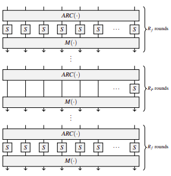

## Cos’è una **Zero-Knowledge Proof** (ZKP)

Una Zero-Knowledge Proof è un protocollo crittografico in cui una parte (detta **prover**) convince un’altra parte (**verifier**) che una certa affermazione è vera **senza rivelare nulla** oltre alla veridicità dell'affermazione stessa.

---

## Le tre proprietà fondamentali delle ZKP

1. **Completezza**
   Se l’affermazione è vera e il prover è onesto, il verifier accetta sempre la prova.

2. **Solidità (Soundness)**
   Se l’affermazione è falsa, un prover disonesto non può convincere il verifier, se non con una probabilità trascurabile.

3. **Zero-Conoscenza**
   Il verifier non impara nulla sull’informazione segreta del prover, se non il fatto che è in possesso di una conoscenza valida.

---

## Perché le Zero-Knowledge Proof sono importanti

Sono fondamentali per:

* **La privacy**: permettono di verificare proprietà di dati o calcoli senza rivelare i dati stessi.
* **Le criptovalute**: ad esempio, Zcash usa zk-SNARKs per nascondere importi e identità dei partecipanti.
* **Le blockchain scalabili**: sistemi come zkRollup, zkEVM o Layer 2 su Ethereum usano ZKP per dimostrare che una serie di transazioni è corretta, senza doverle ricontrollare una per una.
* **L’autenticazione**: si può provare la propria identità senza inviare password o dati personali.

---

## E Poseidon?

Poseidon è una funzione hash progettata **specificamente per essere efficiente nei sistemi di zero-knowledge proof**.
Funzioni hash classiche (come SHA-256) sono inefficienti in questi contesti perché producono circuiti troppo grandi o costosi da verificare.

Poseidon invece:

* funziona bene nei formati R1CS e AET, usati in zk-SNARKs e zk-STARKs
* è ottimizzata per essere **facile da verificare in modo zero-knowledge**
* è progettata per minimizzare il numero di vincoli in una prova, riducendo tempo e spazio

---

### Contesto generale

Nel 2020, i sistemi di **zero-knowledge proof (ZKP)** più diffusi sono:

* **ZK-SNARKs**: come Pinocchio, Groth16, PLONK, Marlin. Sono sistemi compatti e veloci, ma non sicuri contro attacchi quantistici.
* **Bulletproofs**: simili agli SNARKs, ma senza bisogno di trusted setup.
* **ZK-STARKs**: resistenti ai computer quantistici, ma con prove più grandi.
* **MPC-in-the-head**: basati su tecniche di multiparty computation simulate.

I primi due gruppi (SNARKs e Bulletproofs) sono già utilizzati in applicazioni reali. Gli ultimi due (STARKs e MPC-in-the-head) sono promettenti per il futuro, in particolare in uno scenario post-quantum.

---

### Due approcci diversi per descrivere un circuito

Ogni sistema ZKP richiede che il programma o la computazione da provare venga tradotta in un formato matematico. I due principali formati sono:

#### 1. R1CS (Rank-1 Constraint System)

Utilizzato in quasi tutti i SNARKs e nei Bulletproofs.

* Il circuito è descritto da una serie di **vincoli quadrati** del tipo:

  $$
  L_1(X) \cdot L_2(X) = L_3(X)
  $$

  Dove:

  * $X$ è l'insieme di tutte le variabili (input e interne).
  * Ogni $L_i$ è una combinazione lineare delle variabili.
  * Il prodotto avviene in un **campo finito primo** $\mathbb{F}_p$.

* Questo formato traduce ogni moltiplicazione nel circuito in un vincolo.

* Il numero totale di vincoli, chiamato $T$, rappresenta la complessità della computazione.

**Complessità di generazione della prova**: proporzionale a $T$, cioè al numero di moltiplicazioni.

**Campo usato**: (Il campo usato è anche chiamato Goldilocks Field (numero primo) 
$ p = 2^{64} - 2^{32} + 1 = 18446744069414584321 $ da verificare)

* Per i SNARKs: $\mathbb{F}_p$ è il campo scalare di una curva ellittica con proprietà di pairing.
* Per i Bulletproofs: basta una curva ellittica sicura, senza pairing.

#### 2. AET (Algebraic Execution Trace)

Usato dai STARKs e in parte da PLONK.

* La computazione viene vista come una **sequenza di stati**.
* Ogni stato contiene $w$ variabili (es. registri, memoria temporanea).
* Gli stati sono collegati tra loro da **equazioni polinomiali** di grado $d$, che modellano l’evoluzione del programma.
* Il numero di trasformazioni (cioè di passi del programma) è $T$.

**Complessità di generazione della prova**: proporzionale a $w \cdot d \cdot T$.

## Obiettivo principale di Poseidon

Il progetto **Poseidon** nasce con un obiettivo ben preciso:

 **Progettare una famiglia di funzioni hash** che sia:

1. **Ottimale nella metrica R1CS**, che è la più usata nei sistemi ZK-SNARK (es. Groth16, Marlin).
2. **Compatibile anche con la metrica AET**, usata da sistemi come STARKs e PLONK.
3. **Adatta a diversi campi finiti**, quindi non limitata a un solo tipo di campo (come $\mathbb{F}_{2^n}$ o $\mathbb{F}_p$).

In pratica, Poseidon è pensato per essere **universale** e **performante** nelle principali tecnologie di zero-knowledge proof.

---

## Reti SPN: la struttura della funzione hash

Poseidon utilizza un'**architettura SPN** (*Substitution-Permutation Network*), comune in crittografia (come in AES).

### Cos'è una SPN?

Una rete SPN è composta da **più round**, ciascuno con due fasi principali:

1. **Sostituzione (Substitution)**: si applica una funzione non lineare (chiamata **S-box**) a ciascun elemento dello stato.
2. **Permutazione (Permutation)**: si mescolano le variabili per diffondere l'informazione.

Questa struttura è semplice da costruire in circuiti aritmetici e può essere facilmente tradotta sia in R1CS sia in AET.

---

## S-box: la componente non lineare

### Cosa fa la S-box?

La S-box è una **funzione non lineare applicata componente per componente**, cioè:

$$
x \mapsto x^d
$$

Dove:

* $d$ è un intero $\geq 3$
* Questa funzione deve essere **invertibile** e **non lineare**, per garantire sicurezza crittografica.

### Scelta più comune:

$$
x \mapsto x^3
$$

* È la S-box più semplice che soddisfa i requisiti (invertibile, non lineare).
* È scelta **quasi sempre**, tranne nei casi in cui:

  * Il campo usato ha caratteristiche per cui $x^3$ **non è una biiezione** (cioè non è invertibile su tutto il campo).

### In quei casi:

Si propone di usare alternative come:

* $x \mapsto x^5$
* $x \mapsto 1/x$

La scelta dipende dal campo finito specifico utilizzato.

---

## Efficienza nei circuiti: R1CS e AET

Grazie a:

* Una **rappresentazione compatta** del circuito
* Un **basso grado dell'S-box** (grado 3 o 5)

Poseidon consente di ottenere circuiti più semplici da verificare, cioè con:

* **Meno vincoli R1CS**
* **Meno trasformazioni AET complesse**

Questo lo rende **molto efficiente** nei sistemi di prova che usano una delle due metriche.

---

## Poseidon: struttura generale

* La parte centrale di Poseidon è una **permutazione interna** chiamata:

$$
\text{Poseidon}\pi
$$

Poseidonπ segue il **design HADES**, che introduce una variante delle classiche SPN (Substitution-Permutation Network), con una nuova tecnica di ottimizzazione:

### SPN classico

* Ogni round ha:

  1. **S-box layer**: una funzione non lineare su ciascuna cella (es. $x \mapsto x^3$)
  2. **Mixing layer**: una permutazione lineare per diffondere i dati

### HADES Strategy

* Introduce una distinzione tra:

  * **Full rounds**: round normali, con un’applicazione completa della non linearità (una S-box su ogni cella dello stato)
  * **Partial rounds**: round **ottimizzati**, in cui la non linearità viene applicata **solo a una parte dello stato** (tipicamente una sola cella (la prima))

---

## Stato e celle

* Lo **stato** in Poseidon è un vettore di $t$ celle (detto anche "rate + capacity", come in Sponge construction).

  * Ad esempio, se $t = 5$, lo stato ha 5 elementi.

---

## Scopo dei partial rounds

L’uso dei **partial rounds** serve a ridurre i **costi computazionali nei circuiti**:

| Tipo di circuito | Costo principale                  | Impatto dei partial rounds         |
| ---------------- | --------------------------------- | ---------------------------------- |
| **R1CS**         | Ogni S-box genera un vincolo      | Riduce il numero totale di vincoli |
| **AET**          | Più S-box = più gradi polinomiali | Riduce complessità dei polinomi    |


## Riassunto visuale della struttura dei round

Una permutazione tipica in Poseidonπ ha questa sequenza:

```
[FULL round] x R_F/2
[PARTIAL round] x R_P
[FULL round] x R_F/2
```

Questa strategia consente di:

1. **Mantenere sicurezza crittografica**: la permutazione rimane non lineare e ben diffusa.
2. **Ottimizzare i circuiti aritmetici**:

   * In R1CS: meno vincoli → prove più veloci.
   * In AET: gradi più bassi → meno operazioni FFT → prove più leggere.

---

### Sponge construction

La *sponge construction* è un meccanismo per costruire funzioni hash sicure. Funziona tramite una **permutazione interna** che agisce su uno stato diviso in due parti:

$$
t = r + c
$$

dove:

* $t$: dimensione dello stato interno (numero totale di celle)
* $r$: **rate**, la parte dello stato che può essere usata per assorbire input e restituire output
* $c$: **capacità**, la parte segreta che serve a garantire la sicurezza crittografica

---

### Funzionamento

1. **Absorb phase**:
   L’input viene diviso in blocchi di lunghezza $r$. Ogni blocco viene sommato (modulo il campo) alla parte rate dello stato, poi viene applicata la permutazione interna.

2. **Squeeze phase**:
   Dopo aver assorbito tutto l’input, si restituisce l’output leggendo la parte rate dello stato, applicando la permutazione ogni volta che servono altri blocchi.

---

### Significato pratico

| Componente       | Significato                                                                                                                                             |
| ---------------- | ------------------------------------------------------------------------------------------------------------------------------------------------------- |
| **Rate $r$**     | Parte dello stato accessibile esternamente (input/output). Più grande è, più la funzione è veloce.                                                      |
| **Capacità $c$** | Parte dello stato non accessibile, che garantisce la sicurezza contro attacchi (collisioni, preimmagini, ecc.). Più grande è, più la funzione è sicura. |

---

### Compromesso

Aumentare il **rate** significa processare più dati per round → più veloce.
Aumentare la **capacità** significa migliorare la sicurezza → più robusto, ma meno efficiente.

Una funzione hash sicura a 128 bit, in ambito sponge, richiede che:

$$
\frac{c}{2} \geq 128
\quad \Rightarrow \quad
c \geq 256 \text{ bit}
$$

---

### Esempio con Poseidon

Supponiamo che Poseidon lavori su uno stato $t = 6$ celle, e ogni cella rappresenti un elemento in un campo finito di 255 bit. Possiamo scegliere:

* $r = 2$: input e output vengono letti da 2 celle
* $c = 4$: capacità = 4 celle = 1020 bit → sicurezza fino a 510 bit

Ovviamente questa sicurezza è teorica; nella pratica si scelgono $c$ e $r$ per ottenere esattamente 128 o 256 bit di sicurezza.

---

### Conclusione

* Il **rate** è quanto della funzione è "visibile" dall'esterno, cioè quanto input/output possiamo elaborare per round.
* La **capacità** è la parte "nascosta", progettata per garantire la sicurezza crittografica.
* Lo stato totale è la somma delle due, e su di esso agisce la permutazione interna (in Poseidon, Poseidonπ).

---

### **Livelli di sicurezza: 80, 128, 256 bit**

Poseidon è progettato per fornire protezione contro:

* collisioni (trovare due input diversi con lo stesso output),
* preimmagini (dato un output, trovare un input che lo genera),

con livelli di sicurezza **equivalenti** in entrambi i casi: 80, 128 o 256 bit.
Questo significa, ad esempio, che:

* per il livello 128, nessun attacco deve riuscire in meno di $2^{128}$ tentativi.

---

### **Rate e capacità**

* Poseidon è costruito come una **sponge function**.
* Per ogni configurazione di (campo finito, livello di sicurezza), si sceglie un'istanza concreta di Poseidon.
* Una parte dello **stato interno** è riservata alla **capacità**: tipicamente circa **il doppio** del livello di sicurezza richiesto (in bit).

  * Esempio: per 128 bit di sicurezza → capacità ≈ 256 bit.
* Il **resto** dello stato è usato come **rate**, cioè la porzione utile per input/output del messaggio.

---

### **Larghezza della permutazione**

La dimensione complessiva dello stato interno (rate + capacità), cioè la **larghezza della permutazione Poseidonπ**, viene scelta in base all'applicazione:

* **Hashing generico (long-message)** → larghezza ≈ 1280 bit.
* **Merkle tree** → si usano larghezze variabili (ad esempio, per 2:1, 4:1, ecc.) per favorire efficienza nelle prove ZK.

---

### **Crittanalisi condotta**

Poseidon è stato analizzato usando tecniche **algebriche**, considerate le più efficaci contro costruzioni SPN:

* **Interpolazione** (per ricostruire il polinomio della permutazione)
* **Basi di Gröbner** (per risolvere sistemi di equazioni polinomiali)
* **Attacchi differenziali di ordine superiore**

> Nota: Poseidon **non mira a essere una permutazione casuale** (come SHA-3), ma a essere **sufficientemente sicuro contro attacchi pratici**.

---

### **Criterio di sicurezza**

Per un livello di sicurezza $M$, Poseidon viene progettato in modo che **nessun attacco noto** possa distinguere o invertire la permutazione con meno di $2^M$ query.
Non si cerca la perfetta casualità della permutazione, ma che non esistano **proprietà non casuali sfruttabili** da un attacco più efficiente di quello brute-force.

---

### **Numero di round**

Per ogni combinazione di:

* campo finito,
* livello di sicurezza richiesto,
* larghezza della permutazione,

si determina:

1. **il numero massimo di round che un attacco può rompere**,
2. si aggiunge un **margine di sicurezza**,
3. si definisce il numero di **round finali** per l’istanza concreta.

---

### **Efficienza nei sistemi ZK**

Gli autori hanno valutato la complessità di Poseidon nelle due metriche principali:

* **R1CS** (Rank-1 Constraint System): usata in SNARKs classici.
* **AET** (Algebraic Execution Trace): usata in STARKs e in parte anche in PLONK.

---

### **Cos’è POSEIDON?**

Poseidon è una **funzione hash crittografica** che lavora su **campi finiti primi** $\mathbb{F}_p$, dove $p$ è un numero primo di grandezza circa $2^n > 2^{31}$.

In pratica:

* **Input:** stringhe (cioè sequenze di elementi) di lunghezza arbitraria appartenenti a $\mathbb{F}_p^*$
* **Output:** stringhe di **lunghezza fissa** in $\mathbb{F}_p^o$
Di solito $o = 1$, quindi l’output è un solo elemento del campo finito.

Formalmente, Poseidon è una funzione del tipo:

$$
\text{Poseidon}: \mathbb{F}_p^* \to \mathbb{F}_p^o
$$

---

### **Come è costruita?**

Poseidon è costruita come una **funzione a spugna** (*sponge function*), un meccanismo standard per costruire funzioni hash da una permutazione interna.

* La permutazione interna utilizzata è **Poseidonπ**
* Poseidonπ è una variante della permutazione chiamata **HADES-MiMC**
* A differenza di HADES-MiMC, Poseidonπ è **fissata con una chiave nota e costante**, cioè senza segreto. Questo la rende più adatta all’uso come funzione hash piuttosto che come cifrario.

---

### 3. **Che significa p ≈ 2ⁿ e N ≈ log₂(p)·t?**

* Si approssima il primo $p$ come una potenza di 2:
  $p \approx 2^n$, dove $n$ è il numero approssimativo di **bit** necessari per rappresentare un elemento di $\mathbb{F}_p$

* Si definisce:

  $$
  N = n \cdot t \approx \log_2(p) \cdot t
  $$

  dove:

  * $t$ è il numero di celle nello stato interno della permutazione Poseidonπ (cioè il numero totale di elementi del campo nella permutazione)
  * $N$ rappresenta quindi la **dimensione totale dello stato** in bit

Questo serve per stimare la dimensione effettiva della funzione hash in termini di sicurezza o di larghezza dello stato.

---

### **Sponge Construction in Poseidon**

La costruzione a **spugna** (sponge construction) è un meccanismo generico usato per costruire primitive crittografiche come funzioni hash. Viene definita da:

* una **permutazione interna** (nel nostro caso `Poseidonπ`);
* due parametri fondamentali:

  * **rate (r)**: porzione dello stato su cui si assorbono i dati di input e da cui si estrae l’output;
  * **capacity (c)**: porzione dello stato che resta "nascosta" per garantire la sicurezza.

La **dimensione totale dello stato** è:

$$
N = r + c
$$

in bit o in elementi del campo $\mathbb{F}_p$.

---

### **Funzionamento del meccanismo a spugna**

1. **Inizializzazione dello stato:** si parte da uno stato di $r + c$ bit posto a zero.

   $$
   stato = 0^r || 0^c
   $$

2. **Assorbimento (absorb):** l’input viene diviso in blocchi da $r$ bit (o elementi). A ogni blocco:

   * lo si aggiunge (XOR o somma nel campo) alla parte rate dello stato;
   * si applica la permutazione `Poseidonπ` all’intero stato (rate + capacity).

3. **Estrazione (squeeze):** dopo l’assorbimento, si estrae l’output dalla parte rate. Se servono più bit di output, si continua ad applicare `Poseidonπ` e a estrarre di nuovo.

---

### **Sicurezza della sponge**

Se la permutazione interna è indistinguibile da una permutazione casuale, allora:

* la **collision resistance** è garantita fino a $2^{c/2}$;
* la **(second) preimage resistance** è anch’essa fino a $2^{c/2}$.

### **Funzionamento della Poseidon Sponge (algoritmo completo)**

1. **Pre-processing:**

   * Si determinano:

     * la **capacità** $c = 2M$, dove $M$ è il livello di sicurezza in bit,
     * il **rate** $r = N - c$, con $N$ dimensione della permutazione ($N = t \cdot \log_2(p)$),
     * l’eventuale **padding** per portare l’input a una lunghezza multipla di $r$.

2. **Input chunking:**

   * L’input è diviso in blocchi da $r$ bit

3. **Assorbimento iniziale:**

   * Lo **stato interno** è inizializzato a $0^N$.
   * Si prende il primo blocco, lo si somma alla parte **rate** dello stato.
   * Si applica la permutazione completa `Poseidonπ` all’intero stato.

4. **Assorbimento successivo:**

   * Per ciascun blocco rimanente:

     * si somma alla parte rate dello stato,
     * si applica di nuovo la permutazione `Poseidonπ`.

5. **Estrazione (fase di output):**

   * Si estraggono $o$ elementi dalla parte **rate** dello stato.
   * Se servono più elementi di output, si riapplica la permutazione e si continua l’estrazione.

---

Le permutazioni crittografiche di solito consistono in una funzione di round efficiente, applicata un numero sufficiente di volte per far sì che la permutazione si comporti come se fosse stata scelta casualmente.
In generale, si usa la stessa funzione di round per tutta la permutazione, con l’obiettivo di distruggere tutte le possibili simmetrie e proprietà strutturali che potrebbero essere sfruttate per attacchi.

**Nel design HADES**, invece, si considerano diverse funzioni di round all’interno della stessa costruzione. Più precisamente, si alternano round con **layer completi di S-box** e round con **layer parziali di S-box**.

**Motivazione:**

* I layer completi di S-box sono costosi da calcolare sia nel software sia nei sistemi di prova a conoscenza zero (ZK proof systems), ma forniscono una buona protezione contro attacchi statistici (che cercano di sfruttare distribuzioni o pattern nei dati) **strategia “wide trail”**.
* I layer parziali di S-box sono più economici (meno costosi da eseguire), e in alcuni casi sono altrettanto efficaci quanto quelli completi nel contrastare attacchi **algebrici** (che cercano di risolvere equazioni o sfruttare strutture matematiche).

---

### Dettagli sulla strategia HADES:

* All’inizio della permutazione ci sono $R_f$ round in cui si applicano le S-box su **tutto lo stato** (layer completo).
* Dopo questi, ci sono $R_p$ round “nel mezzo” in cui si applica **una sola S-box per round**, mentre il resto dello stato rimane invariato (cioè si usa la funzione identità nelle posizioni senza S-box).
* Infine, alla fine della permutazione ci sono altri $R_f$ round con layer completi di S-box, come all’inizio.




---

### La funzione di round

Ogni funzione di round della nostra permutazione POSEIDON è composta dai seguenti tre componenti:

1. **AddRoundConstants**, denotata con ARC(·)
2. **SubWords**, denotata con S-box(·) o SB(·)
3. **MixLayer**, denotata con M(·)

L’operazione **MixLayer** è lo strato lineare della nostra costruzione, e consiste nel moltiplicare lo stato per una matrice MDS t×t, al fine di applicare la **strategia wide trail**.

Nel complesso otteniamo:

```
ARC → SB → M   ← primo round
→ ··· →
ARC → SB → M   ← (R−1)-esimo round
ARC → SB → M ← R-esimo round
```

Mentre ARC(·) e M(·) sono uguali in ogni round, **il numero di S-box cambia**, precisamente:

* **Rf + Rf = RF** round hanno **layer completi di S-box**, cioè **t** funzioni S-box;
* **RP** round hanno **layer parziali di S-box**, cioè **1** S-box e **(t−1)** funzioni identità.

Anche se i round completi offrono sicurezza equivalente ai round parziali, costano molto di più. Cercare di risparmiare sostituendo t round parziali con 1 completo può sembrare conveniente, ma abbassa la sicurezza, perché 1 round completo ha un grado algebrico molto inferiore rispetto a t round parziali.

---

La **strategia di design HADES** rappresenta un buon punto di partenza per la nostra nuova funzione di hash. Infatti, **la combinazione di round completi e parziali** ci consente di costruire argomentazioni solide sulla sicurezza, sfruttando allo stesso tempo **il numero ridotto di S-box** nei round parziali per ottenere maggiore efficienza.

L'applicazione principale del nostro progetto è l'hashing in **campi primi grandi**, perciò la permutazione **POSEIDONπ** accetta in input **t ≥ 2 parole** in 𝔽ₚ, dove **p è un numero primo di dimensione circa p ≈ 2ⁿ > 2³⁰** (cioè **⌈log₂(p)⌉ = n ≥ 31**). Descrizione dettagliata dei componenti di ciascun round di **POSEIDONπ**.

---

### Lo strato S-box (S-Box Layer)

Per le applicazioni a cui puntiamo, ci concentriamo sulla **S-box di tipo x^α**, definita come:

**S-box(x) = x^α**,
dove **α ≥ 3** è il più piccolo intero positivo tale che **gcd(α, p − 1) = 1** quindi che siano coprimi.

Nel seguito, queste permutazioni sono chiamate “**x^α-POSEIDONπ**”.
Esempi:

* α = 3 (**x³-POSEIDONπ**) se **p ≠ 1 mod 3**
* α = 5 (**x⁵-POSEIDONπ**) se **p ≡ 1 mod 3** ma **p ≠ 1 mod 5**

Si è scoperto che **la S-box x⁵** è adatta per **due tra i campi primi più usati nelle applicazioni ZK**. Perciò viene utilizzato $x^5$.

---

### Lo strato lineare (Linear Layer)

Una **matrice MDS \$t \times t\$** con elementi in \$\mathbb{F}\_p\$ esiste se:

$2t + 1 ≤ p$

Dato $p$ e $t$, esistono vari metodi per costruire una matrice MDS. Uno di questi è l'uso di una **matrice di Cauchy**, che si richiama brevemente:

Per $x_i$, $y_j$ in $\mathbb{F}_p$, con $i ∈ [1, t]$, gli elementi della matrice $M$ sono definiti come:

```math
M_{i,j} = \frac{1}{x_i + y_j}
```

dove gli insiemi $\{x_i\}_{1 \leq i \leq t}$ e $\{y_j\}_{1 \leq j \leq t}$ sono tutte coppie distinte e deve valere che $x_i + y_j \ne 0$ per ogni $i, j \in {1, ..., t}$

### Evitare Matrici Insicure

Sottolineiamo che **non tutte le matrici MDS offrono lo stesso livello di sicurezza**. In particolare, la matrice **M** deve impedire la possibilità di costruire:

1. **Tracce di sottospazi invarianti (o iterativi)** (equivalentemente, **differenziali troncati**) **con probabilità 1** e **con S-box inattive per più di t−1 round** oppure

2. **Tracce di sottospazi invarianti (o iterativi) con probabilità 1** e **con S-box attive per un qualsiasi numero di round**.

---

#### Riguardo al primo punto:

Sia $S^{(i)}$ il sottospazio tale che **nessuna S-box è attiva nei primi i round consecutivi**, cioè:

$$
S^{(i)} := \left\{ v \in \mathbb{F}^t \,\middle|\, [M^j \cdot v]_0 = 0 \in \mathbb{F}, \, \text{per ogni } j < i \right\}
$$

dove $[x]_0$ denota la **prima parola** di $x \in \mathbb{F}^t$, $S^{(0)} = \mathbb{F}^t$, e $\dim(S^{(i)}) \geq t - i$.

Per ogni coppia di testi $(x, y)$ appartenenti allo **stesso coset di $S^{(i)}$**, **nessuna S-box sarà attiva nei primi i round** consecutivi.
Quindi, un **differenziale troncato con probabilità 1** (equivalentemente, una **traccia di sottospazio**) può essere costruito per i primi i ≤ t−1 round.

Pertanto, la matrice **M deve essere scelta** in modo tale da **impedire la costruzione di subspace trail (con o senza S-box attive) per più di t−1 round**.

---
Si propone il seguente metodo per generare matrici sicure:

1. **Selezionare casualmente** insiemi $\{x_i\}_{1 \leq i \leq t}$ e $\{y_j\}_{1 \leq j \leq t}$ con **elementi distinti a coppie**, tali che **xᵢ + yⱼ ≠ 0** per ogni i, j ∈ {1, ..., t}.

2. **Verificare se la matrice è sicura** utilizzando **l’Algoritmo 1, 2 e 3** forniti in \[GRS21].
Una matrice è considerata sicura se **non permette alcuna traccia di sottospazio invariante o iterativa infinita**, **con o senza S-box attive**, **per tutti i round con strati parziali di S-box**.

3. Ripetere la procedura finché non si ottiene una matrice sicura.

---

Abbiamo utilizzato questo metodo per generare le matrici utilizzate nelle istanze presentate nella Sezione 4.
Per l'**Algoritmo 3** di \[GRS21], abbiamo impiegato un **periodo di ricerca $l = 4t$**, e abbiamo inoltre verificato che **non esistano tracce di sottospazio invarianti con S-box attive** per $M, M^2, \dots, M^l$.

Nei nostri esperimenti, abbiamo osservato che **sono necessari pochi tentativi per trovare una matrice sicura**, se il campo è sufficientemente grande.

---

# Applicazioni

**Suggeriamo POSEIDON per tutte le applicazioni di hashing compatibili con lo zero-knowledge**, in particolare:

* **Utilizzo di POSEIDON per commitment in vari protocolli**, nei quali si dimostra in zero-knowledge la conoscenza del valore impegnato:
* 
* **Hashing di oggetti multi-elemento**, con alcuni campi codificati come elementi del campo, in modo che si possano dimostrare proprietà di questi campi in zero-knowledge:

* **Uso di POSEIDON negli alberi di Merkle** per abilitare prove in zero-knowledge della conoscenza di una foglia dell’albero, con la possibilità di includere **dichiarazioni opzionali sul contenuto della foglia**:

* **Cifratura verificabile con POSEIDON** all’interno del framework **Integrated Encryption Scheme**:

Esistono già diversi protocolli di terze parti che **usano POSEIDON nei casi d’uso sopra descritti**:

* **Filecoin** utilizza POSEIDON per **le prove su alberi di Merkle** con diverse arietà e per **commitment a due valori**.

* **Dusk Network** usa POSEIDON per costruire un protocollo **simile a Zcash** per il **trading di titoli finanziari**.

* **Sovrin** impiega POSEIDON per **la revoca basata su alberi di Merkle** \[Lod19].

* **Loopring** utilizza POSEIDON per il **trading privato su Ethereum**.

---

# Crittoanalisi di POSEIDON

Data la mancanza di un metodo in grado di garantire che una funzione hash basata su una costruzione sponge sia sicura contro tutti gli attacchi possibili, basiamo la nostra argomentazione sulla seguente considerazione.

Come abbiamo appena ricordato nella sezione precedente, quando la permutazione interna **P** di una funzione sponge a **(N = c + r)** bit è modellata come una permutazione scelta casualmente, la funzione hash sponge è **indifferenziabile da un oracolo casuale** fino a circa **2^(c/2)** chiamate a **P**.

Quindi scegliamo il numero di round della permutazione interna in modo da garantire sicurezza contro i distinguisher rilevanti per attacchi di collisione e preimage.

Equivalentemente, questo significa che tale numero di round garantisce che **P** non mostri proprietà non casuali o strutturali rilevanti.

---

### 5.1 Definizioni

**Definizione 5.1.** La funzione **F** è **T-sicura contro le collisioni** se non esiste alcun algoritmo con complessità attesa inferiore a **T** che trovi due input distinti **x₁, x₂** tali che **F(x₁) = F(x₂)**.

**Definizione 5.2.** La funzione **F** è **T-sicura contro i preimage** se non esiste alcun algoritmo con complessità attesa inferiore a **T** che, dato un output **y**, trovi un input **x** tale che **F(x) = y**.

**Definizione 5.3.** La funzione **F** è **T-sicura contro i second preimage** se non esiste alcun algoritmo con complessità attesa inferiore a **T** che, dato un input **x₁**, trovi un input diverso **x₂** tale che **F(x₁) = F(x₂)**.

**Definizione 5.4.** La funzione invertibile **P** è **T-sicura contro il problema CICO (m₁, m₂)** se non esiste alcun algoritmo con complessità attesa inferiore a **T** che, dati input **I₁** di lunghezza **m₁ bit** e **O₁** di lunghezza **m₂ bit**, trovi input **I₂, O₂** tali che:
$P(I₁ \| I₂) = P(O₁ \| O₂)$

In termini di sicurezza concreta, affermiamo che POSEIDON-M è sicuro fino a 2^M contro attacchi di collisione e preimage (compresi i second preimage).

---

### 5.3 Risultati principali della crittoanalisi

Qui elenchiamo i punti principali dei nostri risultati crittanalitici.
Il **numero di round $R = R_P + R_F$** che possiamo rompere dipende dal livello di sicurezza $M$ e dal numero di **S-box** $t$, che specificheremo per ciascuna istanza concreta della funzione hash nella sezione successiva.

È importante sottolineare che la crittoanalisi seguente **non è equivalente** a quella presentata per il cifrario a blocchi. Infatti, gli scenari sono diversi:

* nel cifrario, l’obiettivo è garantire l’impossibilità di trovare la **chiave segreta**,
* mentre qui l’obiettivo è assicurarsi che la **permutazione interna appaia pseudo-casuale**, dato che **non c’è alcuna chiave segreta**.

Ciò significa che alcuni attacchi considerati qui **non sono validi per i cifrari a blocchi**, e viceversa.

### Proposizioni Informali

**Proposizione 5.1 (Informale).**
Il seguente numero di round per la variante $x^5$-POSEIDON-128 su $\mathbb{F}_p$ con $p \approx 2^{256}$ protegge contro attacchi statistici e algebrici:

* **$R_F = 6$** (round full),
* **$R = R_F + R_P = 56 + \lceil \log_5(t) \rceil$**.

**Dimostrazione (informale):**
Sostituendo $\alpha = 5$, $M = 128$ e $\log_2(p) = 255$ nelle Equazioni (2), (3), (4), vediamo che **nessuna di esse è soddisfatta**, cioè **gli attacchi falliscono**.

---

**Proposizione 5.2 (Informale).**
Il seguente numero di round per $x^5$-POSEIDON-80 su $\mathbb{F}_p$ con $p \approx 2^{256}$ protegge contro attacchi statistici e algebrici:

* **$R_F = 6$**,
* **$R = R_F + R_P = 35 + \lceil \log_5(t) \rceil$**.

---

**Proposizione 5.3 (Informale).**
Il seguente numero di round per $x^5$-POSEIDON-256 su $\mathbb{F}_p$ con $p \approx 2^{256}$ protegge contro attacchi statistici e algebrici:

* **$R_F = 6$**,
* **$R = R_F + R_P = 111 + \lceil \log_5(t) \rceil$**.

---

### 5.4 Margine di Sicurezza

Dato il **numero minimo di round** necessario a garantire la sicurezza contro **tutti gli attacchi noti in letteratura**, si è **deciso arbitrariamente** di aggiungere un margine di sicurezza come segue:

* si aggiungono **+2 round full** $R_F$,
* si aumenta di **+7.5%** il numero di round partial $R_P$.

Ecco la **traduzione in italiano** della sezione **5.5.1 Attacchi Statistici**, parte del capitolo 5.5 "Dettagli degli Attacchi":

---

### 5.5 Dettagli degli Attacchi

Tutti gli attacchi elencati qui di seguito si applicano alla **permutazione interna POSEIDONπ**.
Il modello sponge impone che **tutti gli attacchi alla funzione di hash con complessità inferiore a $2^{c/2}$** debbano **derivare da attacchi alla permutazione**.
Pertanto, mostriamo che **nessun attacco di questo tipo** dovrebbe esistere sulla permutazione.

---

### 5.5.1 Attacchi Statistici

**Distinguishers Differenziali/Lineari**
Come mostrato nell’appendice, **almeno 6 round** con **layer completi di S-box** (**RF ≥ 6**) sono necessari per garantire la sicurezza contro gli attacchi statistici considerati.

Più nel dettaglio:

Se

$$
RF < 
\begin{cases}
6, & \text{se } M \leq (\lfloor \log_2 p \rfloor - C) \cdot (t + 1) \\
10, & \text{altrimenti}
\end{cases}
$$

allora possono essere possibili attacchi **lineari** (\[Mat93]) e **differenziali** (\[BS91], \[BS93]).

Qui:

* $M$ è il livello di sicurezza desiderato (in bit),
* $p$ è la dimensione del campo (espressa in bit),
* $C = \log_2(\alpha - 1)$, dove $\alpha$ è l'esponente usato nell'S-box (che ha la forma $S(x) = x^\alpha$).

Ad esempio:

* Se $\alpha = 3$ allora $C = 1$,
* Se $\alpha = 5$ allora $C = 2$.

---

Prima di proseguire, sottolineiamo che **consideriamo solo i round con layer completi di S-box** per prevenire gli attacchi statistici.

Tuttavia, **sotto certe assunzioni sul layer lineare**, è possibile considerare **sia i round con S-box parziali che quelli completi** per garantire la sicurezza contro attacchi statistici (come quelli lineari e differenziali).

Nonostante ciò, **la nostra scelta è di basarci solo sui round con S-box completi**, poiché:

* una condizione simile su $RF \geq 6$ è **necessaria anche per la sicurezza contro alcuni attacchi algebrici**,
* e ci permette di fornire **argomentazioni semplici e conservative** per garantire la sicurezza anche contro **altri attacchi statistici**.

---

Ecco la **traduzione in italiano** della sezione iniziale di **Appendice C – Analisi di sicurezza: POSEIDONπ con S-box $x \mapsto x^\alpha$**:

---

### **C Analisi di Sicurezza: POSEIDONπ con $x^\alpha$**

Nel seguito, **assumiamo che la funzione $x \mapsto x^\alpha$** sia **invertibile** nel campo finito considerato.
Questo equivale a richiedere che:

$$
\gcd(\alpha, p - 1) = 1
$$

dove:

* $\alpha$ è l'esponente usato nell’S-box (ad esempio, $\alpha = 5$),
* $p$ è il modulo primo che definisce il campo finito $\mathbb{F}_p$,
* $p - 1$ è l’ordine moltiplicativo del gruppo moltiplicativo di $\mathbb{F}_p^*$,
* $\gcd$ indica il massimo comune divisore.

---

### Spiegazione aggiuntiva (se vuoi capire a fondo):

Il motivo per cui questa condizione è importante è che:

* **Se $\gcd(\alpha, p - 1) = 1$**, allora $x^\alpha$ è una **permutazione invertibile** del campo finito (escludendo lo zero).
* Questo garantisce che la **S-box usata nella permutazione POSEIDONπ** non introduca **collassi o ambiguità**, e sia quindi **sicura dal punto di vista crittografico**.

---

### **C.1.1 Crittanalisi Differenziale**

In questa sezione, ci focalizziamo solo sulle S-box utilizzate nel paper, ovvero:

* $S(x) = x^3$
* $S(x) = x^5$

---


#### **S(x) = x³**

La **crittanalisi differenziale** e le sue varianti sono tra le tecniche più diffuse per analizzare primitive a chiave simmetrica.
La probabilità differenziale di una funzione $f$ su un campo finito $\mathbb{F}_p$ è definita come:

$$
\text{Prob}[\alpha \rightarrow \beta] := \frac{|\{x : f(x + \alpha) - f(x) = \beta\}|}{p}
$$

Poiché la funzione cubica $f(x) = x^3$ è una permutazione **quasi perfettamente non lineare (APN)**, la sua **massima probabilità differenziale** su un campo primo è limitata da:

$$
\text{DP}_{\text{max}} \leq \frac{2}{p}
$$

Come stabilito nella letteratura, **POSEIDONπ è considerato sicuro contro la crittanalisi differenziale** se ogni differenziale ha probabilità **al più $p^{-t}$**.

Tuttavia, poiché è difficile calcolare con precisione questa probabilità, si assume che sia sufficiente che **ogni caratteristica differenziale** abbia probabilità **al più $p^{-2t}$**.

---

#### **Permutazione "semplificata" per l’analisi**

Per rendere l’analisi trattabile, considerano una permutazione **semplificata**:

$$
R_f \circ L \circ R_f(·)
\tag{6}
$$

dove:

* $L$ è uno strato lineare invertibile (ipotesi più debole possibile),
* $R(·) = M \circ \text{S-box} \circ \text{ARK}(·)$, con **S-box piena**, e $M$ è una **matrice MDS**.

L’analisi mostra che questa permutazione è **sicura contro la crittanalisi differenziale** se si impostano:

$$
R_F = 2 \cdot R_f = 10
$$

Il ragionamento è che se la versione "semplificata" è sicura con 10 round a S-box piena, anche POSEIDONπ (che ne ha di più e include anche S-box parziali) **è almeno altrettanto sicuro**, poiché lo strato lineare $L$ viene rimpiazzato con più round completi della versione reale.

---

#### **Numero minimo di S-box attive**

Il numero minimo di S-box attive nella permutazione:

$$
R_s \circ L \circ R_r(·)
$$

è stimato da:

$$
\left\lfloor \frac{s}{2} \right\rfloor + \left\lfloor \frac{r}{2} \right\rfloor \cdot (t + 1) + (s \bmod 2) + (r \bmod 2)
$$

Dove $t$ è il numero di elementi nello stato (la dimensione del vettore di stato).

Usando questi risultati, viene dimostrato che con 4 round "centrali", ci sono **almeno $2 \cdot (t + 1)$** S-box attive, e quindi la probabilità di ogni caratteristica differenziale è:

$$
\left(\frac{2}{p}\right)^{2 \cdot (t + 1)} \leq p^{-2t}
$$

Quindi, con almeno **10 round con S-box piena**, si ottiene sicurezza **fino a 2^M ≤ p^t**.

---

#### **Riassunto del numero minimo di round**

$$
R_F = \begin{cases}
6 & \text{se } M \leq (t + 1) \cdot (\log_2 p - 1) \\
10 & \text{altrimenti}
\end{cases}
$$

---

#### **S(x) = x⁵**

Nel caso della S-box $x^5$, si ha:

$$
\text{DP}_{\text{max}} = \frac{4}{p}
$$

quindi la soglia di sicurezza aumenta:

$$
R_F = \begin{cases}
6 & \text{se } 2t + 2 < N + \lceil \log_2 p \rceil - M \\
10 & \text{altrimenti}
\end{cases}
$$

---

### **C.1.2 Crittanalisi Lineare**

Anche la **crittanalisi lineare** \[Mat93] **non rappresenta una minaccia** per POSEIDONπ se si utilizzano lo stesso numero di round definiti per la crittanalisi differenziale.

Infatti, la **massima correlazione quadratica** della funzione cubica è anch’essa limitata da:

$$
\text{LC}_{\text{max}} = \frac{2}{p}
$$

e questo offre la **migliore resistenza possibile** contro crittanalisi lineari, in modo analogo a quanto accade per la resistenza differenziale delle APN.

---

### Vuoi che continui con la traduzione e spiegazione delle sezioni successive (C.2 Algebraic Attacks), oppure vuoi un riassunto più compatto per inserirlo nella tesi?
